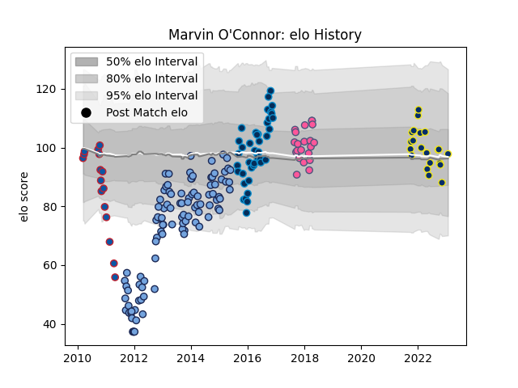

---  
layout: page  
title: Marvin O'Connor  
date: 2023-01-23 15:34:53.433027  
categories: player  
---
# Marvin O'Connor

## Positions: W

## Current elo: 98.0

## Current Percentile: 27.0

# Elo History

# Match History

| Team                 |   Appearances |   Win Rate |
|:---------------------|--------------:|-----------:|
| Bayonne              |           101 |   0.485149 |
| Montpellier Herault  |            43 |   0.674419 |
| Clermont Auvergne    |            21 |   0.47619  |
| Stade Francais Paris |            21 |   0.333333 |
| Grenoble             |            16 |   0.65625  |

| Opponent             |   Matches |   Win Rate |
|:---------------------|----------:|-----------:|
| Bordeaux Begles      |        15 |   0.466667 |
| Toulon               |        13 |   0.269231 |
| Castres Olympique    |        13 |   0.5      |
| Stade Toulousain     |        12 |   0.25     |
| Racing 92            |        12 |   0.25     |
| Montpellier Herault  |        12 |   0.416667 |
| Brive                |        11 |   0.545455 |
| Grenoble             |        10 |   0.65     |
| Stade Francais Paris |         9 |   0.555556 |
| Clermont Auvergne    |         9 |   0.555556 |
| Lyon                 |         9 |   0.5      |
| La Rochelle          |         8 |   0.5625   |
| Oyonnax              |         8 |   0.625    |
| Pau                  |         7 |   0.428571 |
| Agen                 |         7 |   0.714286 |
| Biarritz Olympique   |         7 |   0.785714 |
| Perpignan            |         6 |   0.666667 |
| Wasps                |         4 |   0.125    |
| Mont-de-Marsan       |         3 |   0.666667 |
| Dragons              |         3 |   1        |
| Harlequins           |         3 |   0.666667 |
| Mogliano             |         2 |   1        |
| Calvisano            |         2 |   1        |
| Provence Rugby       |         2 |   1        |
| Bayonne              |         2 |   0.5      |
| Aurillac             |         2 |   1        |
| Auch                 |         2 |   0.5      |
| Colomiers            |         1 |   1        |
| Leinster             |         1 |   1        |
| Cardiff Blues        |         1 |   1        |
| Narbonne             |         1 |   0        |
| Dax                  |         1 |   1        |
| Albi                 |         1 |   1        |
| Stormers             |         1 |   0        |
| Arix Viadana         |         1 |   1        |
| Northampton Saints   |         1 |   0        |