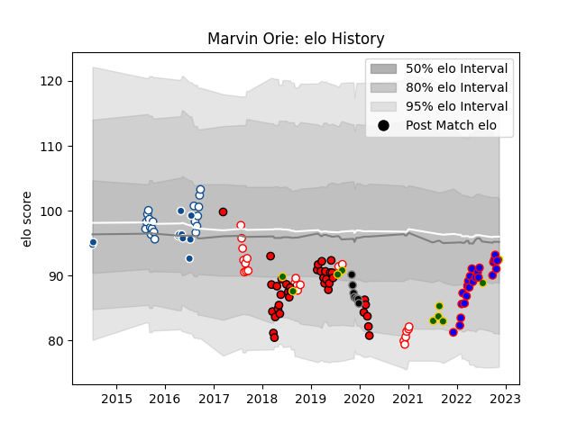

---  
layout: page  
title: Marvin Orie  
date: 2022-11-22 11:29:33.909185  
categories: player  
---
# Marvin Orie

## Positions: L

## Country: South Africa

## Current elo: 97.0

## Current Percentile: 45.0

# Elo History

# Match History

| Team         |   Appearances |   Win Rate |
|:-------------|--------------:|-----------:|
| Lions        |            38 |   0.447368 |
| Golden Lions |            23 |   0.652174 |
| Stormers     |            23 |   0.826087 |
| Blue Bulls   |            19 |   0.736842 |
| South Africa |            11 |   0.636364 |
| Bulls        |            10 |   0.6      |
| Ospreys      |             7 |   0        |

| Opponent                 |   Matches |   Win Rate |
|:-------------------------|----------:|-----------:|
| Western Province         |         8 |   0.5      |
| Griquas                  |         8 |   1        |
| Stormers                 |         6 |   0.5      |
| Jaguares                 |         6 |   0.333333 |
| Bulls                    |         6 |   0.833333 |
| Pumas                    |         6 |   0.833333 |
| Free State Cheetahs      |         6 |   0.666667 |
| Sharks                   |         5 |   0.3      |
| Natal Sharks             |         5 |   0.4      |
| New South Wales Waratahs |         5 |   0.6      |
| Argentina                |         4 |   1        |
| Blue Bulls               |         4 |   0.5      |
| Crusaders                |         3 |   0        |
| Lions                    |         3 |   0.666667 |
| Connacht                 |         3 |   0.333333 |
| Sunwolves                |         3 |   1        |
| Queensland Reds          |         3 |   0.666667 |
| Cardiff Blues            |         3 |   0.333333 |
| Brumbies                 |         3 |   0.333333 |
| Melbourne Rebels         |         3 |   0.666667 |
| Southern Kings           |         2 |   0.5      |
| Scarlets                 |         2 |   0.5      |
| Ulster                   |         2 |   1        |
| Ospreys                  |         2 |   0.75     |
| Wales                    |         2 |   0        |
| Zebre                    |         2 |   1        |
| Eastern Province Kings   |         2 |   1        |
| Australia                |         2 |   0.5      |
| Hurricanes               |         2 |   0        |
| Highlanders              |         2 |   0.5      |
| Golden Lions             |         2 |   0.5      |
| Blues                    |         2 |   0        |
| Edinburgh                |         2 |   1        |
| Leinster                 |         1 |   1        |
| Western Force            |         1 |   1        |
| Boland Cavaliers         |         1 |   1        |
| Cheetahs                 |         1 |   1        |
| Chiefs                   |         1 |   1        |
| Georgia                  |         1 |   1        |
| France                   |         1 |   0        |
| Munster                  |         1 |   0        |
| Saracens                 |         1 |   0        |
| Racing 92                |         1 |   0        |
| Glasgow Warriors         |         1 |   1        |
| Italy                    |         1 |   1        |