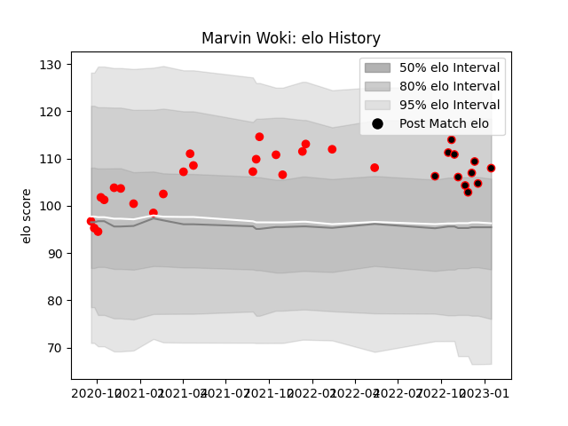

---  
layout: page  
title: Marvin Woki  
date: 2023-03-17 17:31:33.727778  
categories: player  
---
# Marvin Woki

## Positions: L

## Current elo: 94.0

## Current Percentile: 34.0

# Elo History

# Match History

| Team   |   Appearances |   Win Rate |
|:-------|--------------:|-----------:|
| Rouen  |            22 |   0.159091 |
| Nice   |            17 |   0.5      |

| Opponent                   |   Matches |   Win Rate |
|:---------------------------|----------:|-----------:|
| US Bressane                |         3 |        0.5 |
| Carcassonne                |         3 |        0   |
| Montauban                  |         2 |        0   |
| Mont-de-Marsan             |         2 |        0   |
| Valence Romans Drome Rugby |         2 |        0.5 |
| Tarbes                     |         2 |        0.5 |
| Narbonne                   |         2 |        0.5 |
| Bayonne                    |         2 |        0   |
| Vannes                     |         2 |        0   |
| Beziers                    |         2 |        0.5 |
| Bourgoin-Jallieu           |         2 |        0   |
| Cognac Saint Jean d'Angély |         1 |        1   |
| Provence Rugby             |         1 |        0   |
| Biarritz Olympique         |         1 |        0   |
| Blagnac                    |         1 |        1   |
| Suresnes                   |         1 |        1   |
| Soyaux-Angouleme           |         1 |        1   |
| Rennes                     |         1 |        1   |
| Perpignan                  |         1 |        0   |
| Dax                        |         1 |        0   |
| Oyonnax                    |         1 |        0   |
| Nevers                     |         1 |        0   |
| Carqueiranne-Hyères        |         1 |        1   |
| Chambery                   |         1 |        0   |
| Grenoble                   |         1 |        0   |
| Albi                       |         1 |        0.5 |