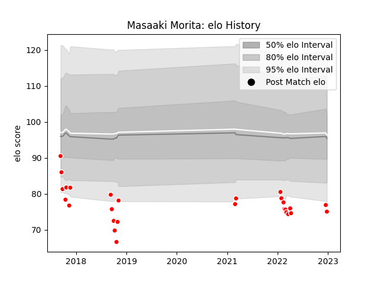

---  
layout: page  
title: Masaaki Morita  
date: 2023-03-21 18:22:13.653919  
categories: player  
---
# Masaaki Morita

Last updated: 2023-03-21
## Positions: W, C

## Current elo: 61.0

## Current Percentile: 2.0

# Elo History

# Match History

| Team                  |   Appearances |   Win Rate |
|:----------------------|--------------:|-----------:|
| Chugoku Red Regulions |            32 |      0.125 |

| Opponent                         |   Matches |   Win Rate |
|:---------------------------------|----------:|-----------:|
| Kurita Water Gush                |         5 |        0.4 |
| Kyuden Voltex                    |         5 |        0   |
| NTT Docomo Red Hurricanes Osaka  |         3 |        0   |
| Kamaishi Seawaves                |         2 |        0   |
| Mazda Blue Zoomers               |         2 |        0.5 |
| Mitsubishi Dynaboars             |         2 |        0   |
| Munakata Sanix Blues             |         2 |        0   |
| Shimizu Blue Sharks              |         2 |        0   |
| Skyactivs Hiroshima              |         2 |        0   |
| Toyota Industries Shuttles Aichi |         2 |        0   |
| Chubu Electric Power             |         1 |        1   |
| Coca-Cola Red Sparks             |         1 |        0   |
| Hanazono Kintetsu Liners         |         1 |        0   |
| Hino Red Dolphins                |         1 |        0   |
| Mie Honda Heat                   |         1 |        0   |