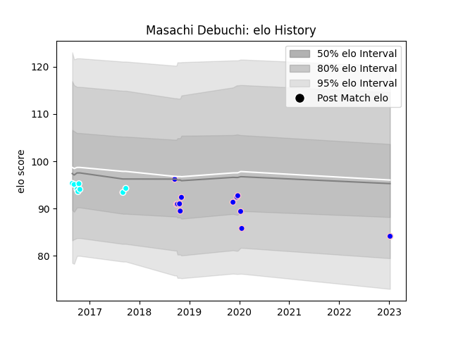

---  
layout: page  
title: Masachi Debuchi  
date: 2023-01-13 11:25:41.654797  
categories: player  
---
# Masachi Debuchi

## Positions: P

## Current elo: 84.0

## Current Percentile: None

# Elo History

# Match History

| Team                             |   Appearances |   Win Rate |
|:---------------------------------|--------------:|-----------:|
| Kurita Water Gush                |            12 |   0.666667 |
| Toyota Industries Shuttles Aichi |             8 |   0.125    |

| Opponent                          |   Matches |   Win Rate |
|:----------------------------------|----------:|-----------:|
| Hanazono Kintetsu Liners          |         2 |          0 |
| Kyuden Voltex                     |         2 |          1 |
| Mazda Blue Zoomers                |         2 |          1 |
| Chugoku Red Regulions             |         1 |          1 |
| Skyactivs Hiroshima               |         1 |          1 |
| Urayasu D-Rocks                   |         1 |          0 |
| Toyota Verblitz                   |         1 |          0 |
| Toyota Industries Shuttles Aichi  |         1 |          0 |
| Toshiba Brave Lupus Tokyo         |         1 |          1 |
| Tokyo Sungoliath                  |         1 |          0 |
| Mitsubishi Dynaboars              |         1 |          0 |
| Shimizu Blue Sharks               |         1 |          1 |
| Green Rockets Tokatsu             |         1 |          0 |
| Kubota Spears Funabashi Tokyo-Bay |         1 |          0 |
| Kobelco Kobe Steelers             |         1 |          0 |
| Kamaishi Seawaves                 |         1 |          1 |
| Yokohama Canon Eagles             |         1 |          0 |