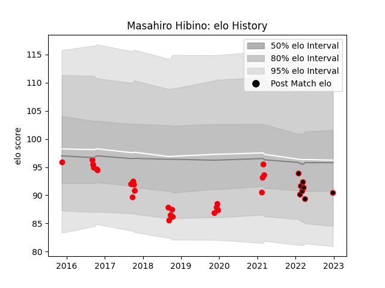

---  
layout: page  
title: Masahiro Hibino  
date: 2023-01-21 15:45:28.810994  
categories: player  
---
# Masahiro Hibino

## Positions: P

## Current elo: 89.0

## Current Percentile: 32.0

# Elo History

# Match History

| Team                 |   Appearances |   Win Rate |
|:---------------------|--------------:|-----------:|
| Coca-Cola Red Sparks |            24 |   0.229167 |
| Mie Honda Heat       |             9 |   0.777778 |

| Opponent                         |   Matches |   Win Rate |
|:---------------------------------|----------:|-----------:|
| Saitama Wild Knights             |         3 |   0        |
| Hanazono Kintetsu Liners         |         3 |   0        |
| Kamaishi Seawaves                |         3 |   0.833333 |
| Skyactivs Hiroshima              |         3 |   1        |
| Yokohama Canon Eagles            |         2 |   0        |
| Hino Red Dolphins                |         2 |   1        |
| Toyota Industries Shuttles Aichi |         2 |   0        |
| Toshiba Brave Lupus Tokyo        |         2 |   0        |
| Shimizu Blue Sharks              |         2 |   1        |
| Toyota Verblitz                  |         1 |   0        |
| Shizuoka Blue Revs               |         1 |   0        |
| Black Rams Tokyo                 |         1 |   0        |
| NTT Docomo Red Hurricanes Osaka  |         1 |   0        |
| Chugoku Red Regulions            |         1 |   1        |
| Mitsubishi Dynaboars             |         1 |   0        |
| Mie Honda Heat                   |         1 |   0        |
| Mazda Blue Zoomers               |         1 |   1        |
| Kyuden Voltex                    |         1 |   1        |
| Kobelco Kobe Steelers            |         1 |   0        |
| Munakata Sanix Blues             |         1 |   0        |