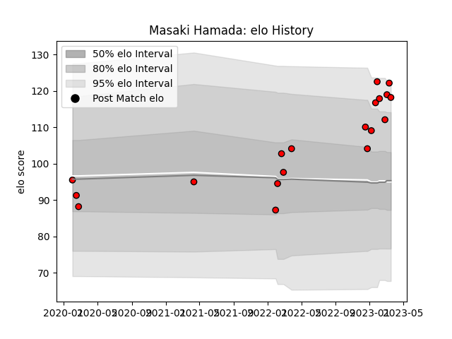

---  
layout: page  
title: Masaki Hamada  
date: 2023-01-13 11:23:30.393655  
categories: player  
---
# Masaki Hamada

## Positions: W

## Current elo: 97.0

## Current Percentile: 41.0

# Elo History

# Match History

| Team                      |   Appearances |   Win Rate |
|:--------------------------|--------------:|-----------:|
| Toshiba Brave Lupus Tokyo |            11 |   0.454545 |

| Opponent              |   Matches |   Win Rate |
|:----------------------|----------:|-----------:|
| Saitama Wild Knights  |         3 |        0   |
| Kobelco Kobe Steelers |         2 |        0.5 |
| Shizuoka Blue Revs    |         2 |        1   |
| Black Rams Tokyo      |         1 |        1   |
| Mitsubishi Dynaboars  |         1 |        1   |
| Toyota Verblitz       |         1 |        0   |
| Urayasu D-Rocks       |         1 |        0   |