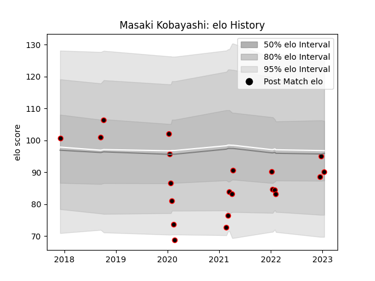

---  
layout: page  
title: Masaki Kobayashi  
date: 2023-01-17 11:38:20.794756  
categories: player  
---
# Masaki Kobayashi

## Positions: W, C

## Current elo: 90.0

## Current Percentile: 47.0

# Elo History

# Match History

| Team                            |   Appearances |   Win Rate |
|:--------------------------------|--------------:|-----------:|
| NTT Docomo Red Hurricanes Osaka |            21 |   0.380952 |

| Opponent                  |   Matches |   Win Rate |
|:--------------------------|----------:|-----------:|
| Black Rams Tokyo          |         3 |   0.333333 |
| Shizuoka Blue Revs        |         3 |   0        |
| Kobelco Kobe Steelers     |         2 |   0        |
| Mitsubishi Dynaboars      |         2 |   1        |
| Saitama Wild Knights      |         2 |   0        |
| Toshiba Brave Lupus Tokyo |         2 |   0        |
| Chugoku Red Regulions     |         1 |   1        |
| Kamaishi Seawaves         |         1 |   1        |
| Kyuden Voltex             |         1 |   1        |
| Munakata Sanix Blues      |         1 |   0        |
| Skyactivs Hiroshima       |         1 |   1        |
| Tokyo Sungoliath          |         1 |   0        |
| Yokohama Canon Eagles     |         1 |   1        |