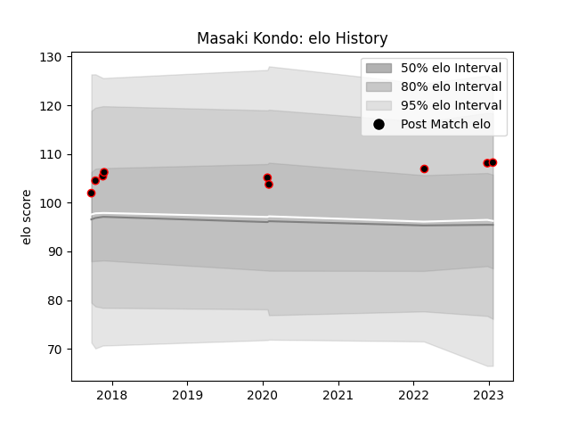

---  
layout: page  
title: Masaki Kondo  
date: 2023-01-21 15:39:59.440135  
categories: player  
---
# Masaki Kondo

## Positions: L

## Current elo: 108.0

## Current Percentile: 77.0

# Elo History

# Match History

| Team           |   Appearances |   Win Rate |
|:---------------|--------------:|-----------:|
| Mie Honda Heat |             9 |   0.777778 |

| Opponent                  |   Matches |   Win Rate |
|:--------------------------|----------:|-----------:|
| Chubu Electric Power      |         1 |          1 |
| Chugoku Red Regulions     |         1 |          1 |
| Hino Red Dolphins         |         1 |          1 |
| Kamaishi Seawaves         |         1 |          1 |
| Mitsubishi Dynaboars      |         1 |          1 |
| Shimizu Blue Sharks       |         1 |          1 |
| Skyactivs Hiroshima       |         1 |          1 |
| Toshiba Brave Lupus Tokyo |         1 |          0 |
| Toyota Verblitz           |         1 |          0 |