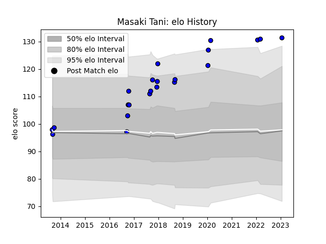

---  
layout: page  
title: Masaki Tani  
date: 2023-01-21 15:40:49.562532  
categories: player  
---
# Masaki Tani

## Positions: FL

## Current elo: 131.0

## Current Percentile: None

# Elo History

# Match History

| Team                 |   Appearances |   Win Rate |
|:---------------------|--------------:|-----------:|
| Saitama Wild Knights |            22 |   0.909091 |

| Opponent                          |   Matches |   Win Rate |
|:----------------------------------|----------:|-----------:|
| Yokohama Canon Eagles             |         4 |       0.75 |
| Coca-Cola Red Sparks              |         3 |       1    |
| Kubota Spears Funabashi Tokyo-Bay |         3 |       1    |
| Black Rams Tokyo                  |         2 |       1    |
| NTT Docomo Red Hurricanes Osaka   |         2 |       1    |
| Green Rockets Tokatsu             |         1 |       1    |
| Hanazono Kintetsu Liners          |         1 |       1    |
| Munakata Sanix Blues              |         1 |       1    |
| Shizuoka Blue Revs                |         1 |       1    |
| Tokyo Sungoliath                  |         1 |       0    |
| Toyota Industries Shuttles Aichi  |         1 |       1    |
| Toyota Verblitz                   |         1 |       1    |
| Urayasu D-Rocks                   |         1 |       1    |