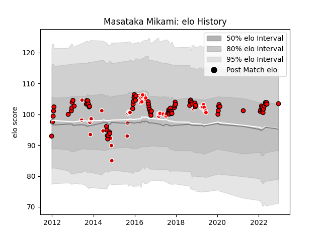

---  
layout: page  
title: Masataka Mikami  
date: 2023-01-15 11:48:34.954066  
categories: player  
---
# Masataka Mikami

## Positions: P

## Country: Japan

## Current elo: 106.0

## Current Percentile: 80.0

# Elo History

# Match History

| Team                      |   Appearances |   Win Rate |
|:--------------------------|--------------:|-----------:|
| Toshiba Brave Lupus Tokyo |            51 |   0.627451 |
| Sunwolves                 |            33 |   0.106061 |
| Japan                     |            22 |   0.590909 |

| Opponent                          |   Matches |   Win Rate |
|:----------------------------------|----------:|-----------:|
| Shizuoka Blue Revs                |         6 |   0.5      |
| Saitama Wild Knights              |         6 |   0.166667 |
| Stormers                          |         5 |   0.1      |
| Black Rams Tokyo                  |         4 |   0.75     |
| Kubota Spears Funabashi Tokyo-Bay |         4 |   0.5      |
| Tokyo Sungoliath                  |         4 |   0.75     |
| Scotland                          |         4 |   0        |
| Yokohama Canon Eagles             |         4 |   0.75     |
| Melbourne Rebels                  |         3 |   0        |
| Bulls                             |         3 |   0        |
| Coca-Cola Red Sparks              |         3 |   1        |
| Kobelco Kobe Steelers             |         3 |   0.666667 |
| Cheetahs                          |         3 |   0        |
| Lions                             |         3 |   0        |
| Mie Honda Heat                    |         3 |   1        |
| Samoa                             |         2 |   1        |
| Sharks                            |         2 |   0        |
| Southern Kings                    |         2 |   0        |
| Hanazono Kintetsu Liners          |         2 |   1        |
| Hurricanes                        |         2 |   0        |
| Brumbies                          |         2 |   0        |
| Toyota Verblitz                   |         2 |   0.5      |
| Uruguay                           |         2 |   1        |
| Wales                             |         2 |   0.5      |
| Georgia                           |         2 |   0.5      |
| Russia                            |         2 |   1        |
| Mitsubishi Dynaboars              |         2 |   0.5      |
| Munakata Sanix Blues              |         2 |   0.5      |
| Jaguares                          |         2 |   0.5      |
| Green Rockets Tokatsu             |         2 |   1        |
| Queensland Reds                   |         2 |   0        |
| New Zealand                       |         2 |   0        |
| New South Wales Waratahs          |         2 |   0.5      |
| South Africa                      |         1 |   1        |
| NTT Docomo Red Hurricanes Osaka   |         1 |   1        |
| Spain                             |         1 |   1        |
| Kyuden Voltex                     |         1 |   1        |
| Toyota Industries Shuttles Aichi  |         1 |   0        |
| Blues                             |         1 |   1        |
| United States of America          |         1 |   1        |
| Urayasu D-Rocks                   |         1 |   0        |
| New Zealand Maori                 |         1 |   0        |
| Italy                             |         1 |   1        |
| Western Force                     |         1 |   0        |
| Romania                           |         1 |   1        |