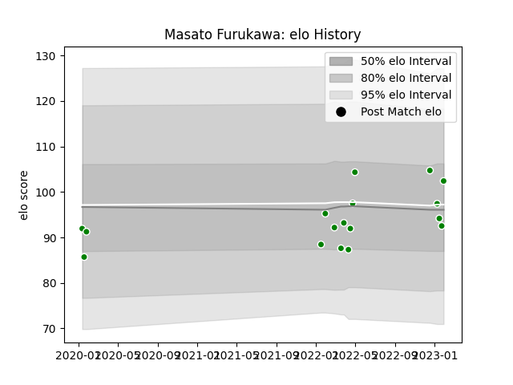

---  
layout: page  
title: Masato Furukawa  
date: 2022-12-18 16:18:25.781561  
categories: player  
---
# Masato Furukawa

## Positions: FL

## Current elo: 104.0

## Current Percentile: 77.0

# Elo History

# Match History

| Team            |   Appearances |   Win Rate |
|:----------------|--------------:|-----------:|
| Toyota Verblitz |            12 |   0.583333 |

| Opponent                          |   Matches |   Win Rate |
|:----------------------------------|----------:|-----------:|
| Shizuoka Blue Revs                |         3 |   0.666667 |
| Toshiba Brave Lupus Tokyo         |         2 |   0.5      |
| Black Rams Tokyo                  |         1 |   1        |
| Green Rockets Tokatsu             |         1 |   1        |
| Hino Red Dolphins                 |         1 |   1        |
| Kubota Spears Funabashi Tokyo-Bay |         1 |   0        |
| NTT Docomo Red Hurricanes Osaka   |         1 |   1        |
| Saitama Wild Knights              |         1 |   0        |
| Yokohama Canon Eagles             |         1 |   0        |