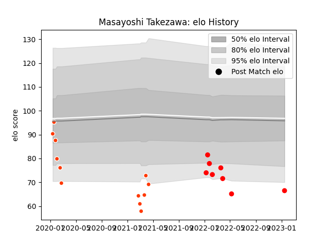

---  
layout: page  
title: Masayoshi Takezawa  
date: 2023-03-21 18:51:13.194717  
categories: player  
---
# Masayoshi Takezawa

Last updated: 2023-03-21
## Positions: W

## Current elo: 78.0

## Current Percentile: 5.0

# Elo History

# Match History

| Team                  |   Appearances |   Win Rate |
|:----------------------|--------------:|-----------:|
| Hino Red Dolphins     |            20 |        0.2 |
| Yokohama Canon Eagles |            15 |        0.7 |

| Opponent                          |   Matches |   Win Rate |
|:----------------------------------|----------:|-----------:|
| Green Rockets Tokatsu             |         5 |   1        |
| Toyota Verblitz                   |         5 |   0.4      |
| Kobelco Kobe Steelers             |         3 |   0.333333 |
| Kubota Spears Funabashi Tokyo-Bay |         3 |   0        |
| Shizuoka Blue Revs                |         3 |   0.166667 |
| Tokyo Sungoliath                  |         3 |   0        |
| Black Rams Tokyo                  |         2 |   0.5      |
| Saitama Wild Knights              |         2 |   0        |
| Urayasu D-Rocks                   |         2 |   0        |
| Hanazono Kintetsu Liners          |         1 |   1        |
| Mitsubishi Dynaboars              |         1 |   1        |
| Munakata Sanix Blues              |         1 |   1        |
| NTT Docomo Red Hurricanes Osaka   |         1 |   0        |
| Shimizu Blue Sharks               |         1 |   1        |
| Toshiba Brave Lupus Tokyo         |         1 |   1        |
| Toyota Industries Shuttles Aichi  |         1 |   0        |