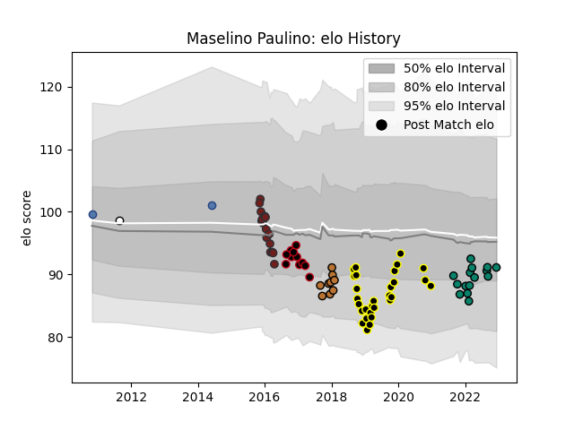

---  
layout: page  
title: Maselino Paulino  
date: 2022-12-18 16:15:57.663867  
categories: player  
---
# Maselino Paulino

## Positions: L

## Country: Samoa

## Current elo: 91.0

## Current Percentile: 25.0

# Elo History

# Match History

| Team           |   Appearances |   Win Rate |
|:---------------|--------------:|-----------:|
| Mont-de-Marsan |            29 |   0.517241 |
| Scarlets       |            17 |   0.352941 |
| Montauban      |            15 |   0.4      |
| Lyon           |            11 |   0.227273 |
| Narbonne       |             9 |   0.333333 |
| Samoa          |             2 |   0.5      |
| Hawke's Bay    |             1 |   0        |

| Opponent            |   Matches |   Win Rate |
|:--------------------|----------:|-----------:|
| Carcassonne         |         5 |   0.2      |
| Nevers              |         4 |   0.5      |
| Perpignan           |         4 |   0.25     |
| Beziers             |         4 |   0.5      |
| Grenoble            |         3 |   0.666667 |
| Glasgow Warriors    |         3 |   0        |
| Ospreys             |         3 |   0.333333 |
| Oyonnax             |         3 |   0.666667 |
| Montauban           |         3 |   1        |
| Provence Rugby      |         3 |   0        |
| Racing 92           |         3 |   0        |
| Soyaux-Angouleme    |         3 |   0.333333 |
| Vannes              |         3 |   0.666667 |
| Colomiers           |         3 |   0.333333 |
| Aurillac            |         2 |   0.5      |
| US Bressane         |         2 |   0.5      |
| Northampton Saints  |         2 |   0        |
| Newcastle Falcons   |         2 |   0.5      |
| Agen                |         2 |   0.5      |
| Mont-de-Marsan      |         2 |   0.5      |
| Dax                 |         2 |   0        |
| Bayonne             |         2 |   0.5      |
| Benetton Treviso    |         2 |   1        |
| Biarritz Olympique  |         2 |   0.5      |
| Brive               |         2 |   0.75     |
| Cardiff Blues       |         2 |   0        |
| Japan               |         2 |   0.5      |
| Edinburgh           |         1 |   0        |
| Connacht            |         1 |   1        |
| Montpellier Herault |         1 |   0        |
| Northland           |         1 |   0        |
| Roval Drome XV      |         1 |   0        |
| Stade Toulousain    |         1 |   0        |
| Toulon              |         1 |   0        |
| Leinster            |         1 |   0        |
| Ulster              |         1 |   1        |
| Massy               |         1 |   1        |
| Zebre               |         1 |   1        |