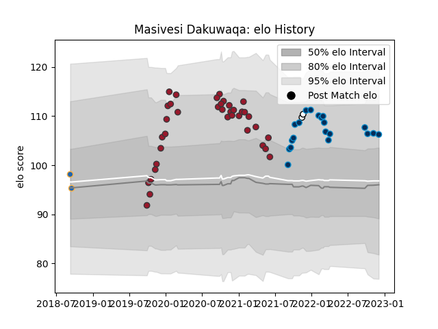

---  
layout: page  
title: Masivesi Dakuwaqa  
date: 2023-02-05 15:09:08.357181  
categories: player  
---
# Masivesi Dakuwaqa

## Positions: W, FL

## Country: Fiji

## Current elo: 100.0

## Current Percentile: 61.0

# Elo History

# Match History

| Team                |   Appearances |   Win Rate |
|:--------------------|--------------:|-----------:|
| Toulon              |            37 |   0.594595 |
| Montpellier Herault |            24 |   0.583333 |
| Fiji                |             3 |   0.5      |
| Western Force       |             3 |   0.666667 |

| Opponent             |   Matches |   Win Rate |
|:---------------------|----------:|-----------:|
| Brive                |         5 |   0.5      |
| Stade Francais Paris |         5 |   0.6      |
| Pau                  |         5 |   0.8      |
| Lyon                 |         4 |   0.5      |
| Bayonne              |         4 |   0.75     |
| Toulon               |         4 |   0.625    |
| Castres Olympique    |         4 |   0.25     |
| La Rochelle          |         4 |   0.5      |
| Bordeaux Begles      |         3 |   0.333333 |
| Stade Toulousain     |         3 |   0.166667 |
| London Irish         |         3 |   1        |
| Scarlets             |         2 |   1        |
| Perpignan            |         2 |   1        |
| Montpellier Herault  |         2 |   0.75     |
| Agen                 |         2 |   1        |
| Clermont Auvergne    |         2 |   0        |
| Biarritz Olympique   |         2 |   1        |
| Leinster             |         1 |   0        |
| NSW Country Eagles   |         1 |   1        |
| Ospreys              |         1 |   0        |
| Leicester Tigers     |         1 |   1        |
| Georgia              |         1 |   0.5      |
| Queensland Country   |         1 |   1        |
| Racing 92            |         1 |   1        |
| Spain                |         1 |   1        |
| Canberra Vikings     |         1 |   0        |
| Bristol Rugby        |         1 |   0        |
| Wales                |         1 |   0        |