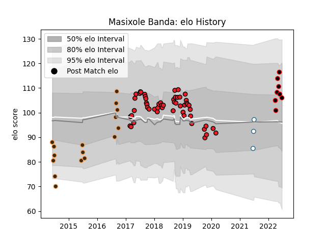

---  
layout: page  
title: Masixole Banda  
date: 2023-03-27 11:34:47.650771  
categories: player  
---
# Masixole Banda

Last updated: 2023-03-27
## Positions: FB, FH

## Current elo: 106.0

## Current Percentile: 75.0

# Elo History

# Match History

| Team                   |   Appearances |   Win Rate |
|:-----------------------|--------------:|-----------:|
| Southern Kings         |            53 |   0.179245 |
| Border Bulldogs        |            16 |   0.375    |
| Eastern Province Kings |             8 |   0.625    |
| Griquas                |             3 |   0.333333 |

| Opponent                 |   Matches |   Win Rate |
|:-------------------------|----------:|-----------:|
| Cheetahs                 |         6 |   0        |
| Benetton Treviso         |         5 |   0        |
| Griffons                 |         5 |   0.2      |
| Valke                    |         4 |   0.5      |
| Ulster                   |         4 |   0        |
| Dragons                  |         4 |   0.375    |
| Leopards                 |         4 |   0.25     |
| Connacht                 |         3 |   0        |
| Munster                  |         3 |   0        |
| Edinburgh                |         3 |   0.333333 |
| Boland Cavaliers         |         3 |   0.666667 |
| Glasgow Warriors         |         3 |   0.333333 |
| Scarlets                 |         3 |   0        |
| SWD Eagles               |         3 |   0.666667 |
| Leinster                 |         3 |   0        |
| Sharks                   |         2 |   0.5      |
| Ospreys                  |         2 |   0        |
| Cardiff Blues            |         2 |   0        |
| Zebre                    |         2 |   0        |
| Jaguares                 |         2 |   0.5      |
| Griquas                  |         2 |   0.5      |
| Namibia Welwitchias      |         1 |   1        |
| Melbourne Rebels         |         1 |   1        |
| New South Wales Waratahs |         1 |   1        |
| Black Lion               |         1 |   0        |
| Pumas                    |         1 |   0        |
| Queensland Reds          |         1 |   0        |
| Bulls                    |         1 |   1        |
| Stormers                 |         1 |   0        |
| Sunwolves                |         1 |   1        |
| Border Bulldogs          |         1 |   1        |
| Free State Cheetahs      |         1 |   1        |
| Natal Sharks             |         1 |   0        |