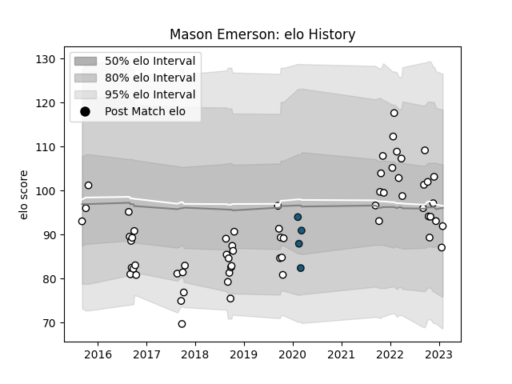

---  
layout: page  
title: Mason Emerson  
date: 2023-01-23 15:35:24.950093  
categories: player  
---
# Mason Emerson

## Positions: W

## Current elo: 87.0

## Current Percentile: 42.0

# Elo History

# Match History

| Team                       |   Appearances |   Win Rate |
|:---------------------------|--------------:|-----------:|
| Hawke's Bay                |            37 |   0.432432 |
| Valence Romans Drome Rugby |            24 |   0.8125   |
| Colorado Raptors           |             4 |   0.5      |

| Opponent                   |   Matches |   Win Rate |
|:---------------------------|----------:|-----------:|
| Bay of Plenty              |         4 |   0.25     |
| Counties Manukau           |         4 |   0.25     |
| Southland                  |         4 |   1        |
| North Harbour              |         3 |   0.333333 |
| Waikato                    |         3 |   0.333333 |
| Blagnac                    |         3 |   0.666667 |
| Tasman                     |         3 |   0        |
| Taranaki                   |         3 |   0.333333 |
| Suresnes                   |         3 |   1        |
| Cognac Saint Jean d'Angély |         3 |   1        |
| Manawatu                   |         3 |   1        |
| Otago                      |         3 |   0.666667 |
| Northland                  |         2 |   0.5      |
| Soyaux-Angouleme           |         2 |   0.5      |
| Rennes                     |         2 |   1        |
| Wellington                 |         2 |   0.5      |
| Dax                        |         2 |   0.5      |
| Chambery                   |         2 |   0.5      |
| Canterbury                 |         2 |   0        |
| Bourgoin-Jallieu           |         2 |   0.75     |
| Aubenas                    |         1 |   1        |
| Nice                       |         1 |   1        |
| Narbonne                   |         1 |   1        |
| San Diego Legion           |         1 |   0        |
| Houston SaberCats          |         1 |   0        |
| Tarbes                     |         1 |   1        |
| Toronto Arrows             |         1 |   1        |
| Utah Warriors              |         1 |   1        |
| Auckland                   |         1 |   0        |
| Albi                       |         1 |   1        |