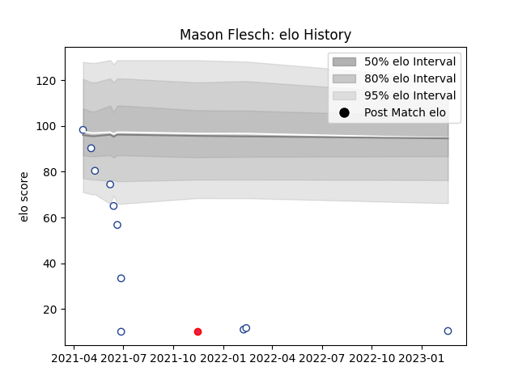

---  
layout: page  
title: Mason Flesch  
date: 2023-03-21 18:33:57.868050  
categories: player  
---
# Mason Flesch

Last updated: 2023-03-21
## Positions: L, FL

## Country: Canada

## Current elo: 10.0

## Current Percentile: 0.0

# Elo History

# Match History

| Team           |   Appearances |   Win Rate |
|:---------------|--------------:|-----------:|
| Toronto Arrows |            15 |   0.133333 |
| Canada         |             1 |   1        |

| Opponent          |   Matches |   Win Rate |
|:------------------|----------:|-----------:|
| Rugby ATL         |         3 |        0   |
| NOLA Gold         |         2 |        0   |
| Rugby New York    |         2 |        0   |
| Seattle Seawolves |         2 |        0.5 |
| Austin Gilgronis  |         1 |        0   |
| Belgium           |         1 |        1   |
| Chicago Hounds    |         1 |        1   |
| L. A. Giltinis    |         1 |        0   |
| Old Glory DC      |         1 |        0   |
| R.U. New York     |         1 |        0   |
| San Diego Legion  |         1 |        0   |