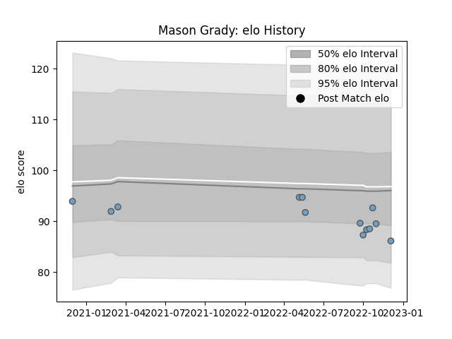

---  
layout: page  
title: Mason Grady  
date: 2023-03-17 17:25:47.794436  
categories: player  
---
# Mason Grady

## Positions: C

## Country: Wales

## Current elo: 94.0

## Current Percentile: 25.0

# Elo History

# Match History

| Team          |   Appearances |   Win Rate |
|:--------------|--------------:|-----------:|
| Cardiff Blues |            20 |       0.55 |
| Wales         |             2 |       0.5  |

| Opponent          |   Matches |   Win Rate |
|:------------------|----------:|-----------:|
| Dragons           |         3 |        1   |
| Newcastle Falcons |         3 |        1   |
| Benetton Treviso  |         2 |        0.5 |
| Brive             |         2 |        0.5 |
| Glasgow Warriors  |         2 |        0   |
| Scarlets          |         2 |        0.5 |
| Bulls             |         1 |        0   |
| Edinburgh         |         1 |        0   |
| England           |         1 |        0   |
| Italy             |         1 |        1   |
| Lions             |         1 |        0   |
| Munster           |         1 |        0   |
| Stormers          |         1 |        1   |
| Zebre             |         1 |        1   |