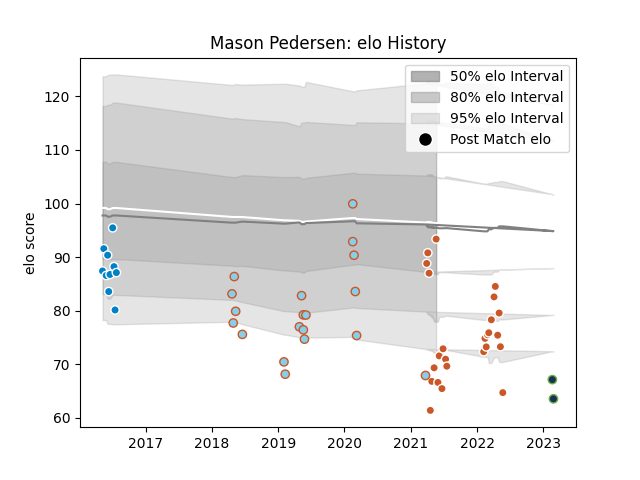

---  
layout: page  
title: Mason Pedersen  
date: 2023-03-21 18:29:20.529424  
categories: player  
---
# Mason Pedersen

Last updated: 2023-03-21
## Positions: P

## Current elo: 93.0

## Current Percentile: 3.0

# Elo History

# Match History

| Team               |   Appearances |   Win Rate |
|:-------------------|--------------:|-----------:|
| Austin Gilgronis   |            25 |  0.64      |
| Austin Elite Rugby |            13 |  0.0769231 |
| San Diego          |            10 |  0.3       |
| Austin Herd        |             6 |  0.25      |
| Seattle Seawolves  |             5 |  1         |

| Opponent               |   Matches |   Win Rate |
|:-----------------------|----------:|-----------:|
| Utah Warriors          |         8 |   0.1875   |
| Houston SaberCats      |         7 |   0.714286 |
| Seattle Seawolves      |         5 |   0.8      |
| L. A. Giltinis         |         4 |   0.25     |
| San Diego Legion       |         4 |   0.5      |
| Old Glory DC           |         3 |   0.333333 |
| San Francisco          |         3 |   0.333333 |
| Rugby New York         |         3 |   0.333333 |
| Dallas Jackals         |         3 |   1        |
| Ohio                   |         3 |   0.333333 |
| NOLA Gold              |         3 |   1        |
| Denver                 |         2 |   0        |
| Rugby ATL              |         2 |   1        |
| Sacramento             |         2 |   0.5      |
| New England Free Jacks |         2 |   0        |
| Toronto Arrows         |         2 |   0        |
| R.U. New York          |         2 |   0        |
| Glendale Raptors       |         1 |   0        |