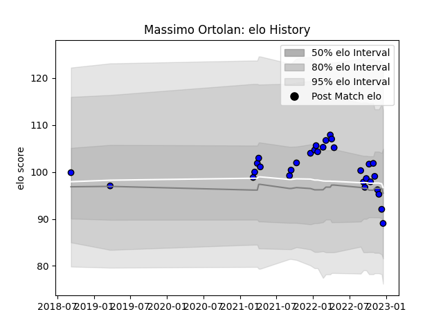

---  
layout: page  
title: Massimo Ortolan  
date: 2023-03-17 17:37:39.782401  
categories: player  
---
# Massimo Ortolan

## Positions: FH

## Current elo: 81.0

## Current Percentile: 43.0

# Elo History

# Match History

| Team   |   Appearances |   Win Rate |
|:-------|--------------:|-----------:|
| Massy  |            54 |   0.481481 |

| Opponent                   |   Matches |   Win Rate |
|:---------------------------|----------:|-----------:|
| Soyaux-Angouleme           |         4 |       0.25 |
| Albi                       |         4 |       0.5  |
| Dijon                      |         2 |       1    |
| Cognac Saint Jean d'Angély |         2 |       1    |
| Nice                       |         2 |       0    |
| Nevers                     |         2 |       0    |
| Montauban                  |         2 |       0.5  |
| Mont-de-Marsan             |         2 |       0.5  |
| Dax                        |         2 |       1    |
| Suresnes                   |         2 |       1    |
| Tarbes                     |         2 |       1    |
| Carcassonne                |         2 |       1    |
| US Bressane                |         2 |       0.5  |
| Bourgoin-Jallieu           |         2 |       0.5  |
| Blagnac                    |         2 |       0.5  |
| Biarritz Olympique         |         2 |       0    |
| Beziers                    |         2 |       0    |
| Aurillac                   |         2 |       0    |
| Aubenas                    |         2 |       1    |
| Rouen                      |         2 |       0    |
| Provence Rugby             |         1 |       1    |
| Valence Romans Drome Rugby |         1 |       1    |
| Agen                       |         1 |       0    |
| Oyonnax                    |         1 |       0    |
| Grenoble                   |         1 |       0    |
| Colomiers                  |         1 |       0    |
| Chambery                   |         1 |       1    |
| Brive                      |         1 |       0    |
| Bayonne                    |         1 |       0    |
| Vannes                     |         1 |       1    |