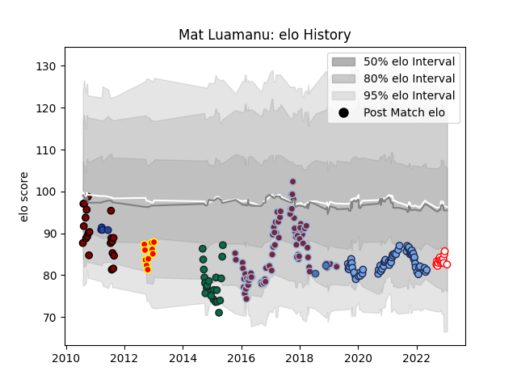

---  
layout: page  
title: Mat Luamanu  
date: 2022-12-14 11:23:46.881580  
categories: player  
---
# Mat Luamanu

## Positions: N8, L

## Current elo: 93.0

## Current Percentile: 29.0

# Elo History

# Match History

| Team             |   Appearances |   Win Rate |
|:-----------------|--------------:|-----------:|
| Harlequins       |            77 |   0.428571 |
| Bayonne          |            47 |   0.574468 |
| Benetton Treviso |            22 |   0.113636 |
| North Harbour    |            21 |   0.285714 |
| Dax              |            13 |   0.846154 |
| Blues            |             4 |   0.75     |
| Kyuden Voltex    |             4 |   0.5      |

| Opponent                        |   Matches |   Win Rate |
|:--------------------------------|----------:|-----------:|
| Northampton Saints              |         8 |   0.25     |
| Agen                            |         7 |   0.785714 |
| Exeter Chiefs                   |         7 |   0.285714 |
| Wasps                           |         7 |   0.571429 |
| Worcester Warriors              |         7 |   0.714286 |
| London Irish                    |         6 |   0.5      |
| Sale Sharks                     |         6 |   0.166667 |
| La Rochelle                     |         5 |   0.2      |
| Montpellier Herault             |         5 |   0.4      |
| Saracens                        |         5 |   0.4      |
| Racing 92                       |         5 |   0.4      |
| Newcastle Falcons               |         4 |   0.5      |
| Edinburgh                       |         4 |   0        |
| Leicester Tigers                |         4 |   0.25     |
| Stade Toulousain                |         4 |   0.5      |
| Bath Rugby                      |         4 |   0.5      |
| Gloucester Rugby                |         4 |   0.5      |
| Stade Francais Paris            |         4 |   0.75     |
| Ospreys                         |         3 |   0.333333 |
| Toulon                          |         3 |   0.666667 |
| Pau                             |         3 |   0        |
| Ulster                          |         3 |   0        |
| Hawke's Bay                     |         2 |   0        |
| Manawatu                        |         2 |   0.5      |
| Leinster                        |         2 |   0.25     |
| Scarlets                        |         2 |   0        |
| Munster                         |         2 |   0        |
| Narbonne                        |         2 |   1        |
| Northland                       |         2 |   1        |
| Otago                           |         2 |   0.5      |
| Benetton Treviso                |         2 |   0.5      |
| Glasgow Warriors                |         2 |   0        |
| Cardiff Blues                   |         2 |   1        |
| Wellington                      |         2 |   0        |
| Counties Manukau                |         2 |   0        |
| Connacht                        |         2 |   0        |
| Auckland                        |         2 |   0        |
| Clermont Auvergne               |         2 |   0.5      |
| Tasman                          |         2 |   1        |
| Castres Olympique               |         2 |   0.5      |
| Dragons                         |         2 |   0        |
| Carcassonne                     |         2 |   0.5      |
| Brive                           |         2 |   0.5      |
| Bristol Rugby                   |         2 |   1        |
| Saitama Wild Knights            |         1 |   0        |
| Waikato                         |         1 |   0        |
| Valence Romans Drome Rugby      |         1 |   1        |
| Rouen                           |         1 |   1        |
| Suresnes                        |         1 |   1        |
| Urayasu D-Rocks                 |         1 |   0        |
| US Bressane                     |         1 |   1        |
| Timisoara Saracens              |         1 |   1        |
| Southland                       |         1 |   0        |
| Tarbes                          |         1 |   1        |
| Taranaki                        |         1 |   0        |
| Rennes                          |         1 |   1        |
| Bay of Plenty                   |         1 |   0        |
| Provence Rugby                  |         1 |   1        |
| Chiefs                          |         1 |   1        |
| Beziers                         |         1 |   1        |
| Black Rams Tokyo                |         1 |   1        |
| Blagnac                         |         1 |   1        |
| Bordeaux Begles                 |         1 |   0        |
| Bourgoin-Jallieu                |         1 |   0        |
| Canterbury                      |         1 |   0        |
| Carqueiranne-Hyères             |         1 |   1        |
| Chambery                        |         1 |   1        |
| Cheetahs                        |         1 |   1        |
| Cognac Saint Jean d'Angély      |         1 |   1        |
| Aurillac                        |         1 |   1        |
| Crusaders                       |         1 |   0        |
| Grenoble                        |         1 |   1        |
| Hurricanes                      |         1 |   1        |
| Lyon                            |         1 |   0        |
| Albi                            |         1 |   0        |
| Mont-de-Marsan                  |         1 |   0        |
| NTT Docomo Red Hurricanes Osaka |         1 |   1        |
| Nevers                          |         1 |   0.5      |
| Nice                            |         1 |   1        |
| Montauban                       |         1 |   1        |