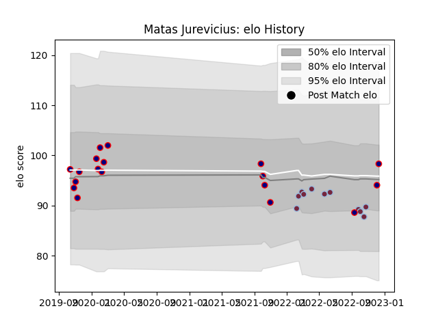

---  
layout: page  
title: Matas Jurevicius  
date: 2022-12-18 16:26:36.172429  
categories: player  
---
# Matas Jurevicius

## Positions: L, FL

## Current elo: 98.0

## Current Percentile: 44.0

# Elo History

# Match History

| Team            |   Appearances |   Win Rate |
|:----------------|--------------:|-----------:|
| London Scottish |            18 |   0.25     |
| Harlequins      |            11 |   0.545455 |

| Opponent            |   Matches |   Win Rate |
|:--------------------|----------:|-----------:|
| Ampthill            |         3 |   0.166667 |
| Doncaster           |         3 |   0        |
| Newcastle Falcons   |         2 |   0.5      |
| Saracens            |         2 |   0        |
| Sale Sharks         |         2 |   0.5      |
| Nottingham          |         2 |   0        |
| Yorkshire Carnegie  |         2 |   1        |
| Ealing Trailfinders |         2 |   0        |
| Gloucester Rugby    |         1 |   1        |
| Hartpury College    |         1 |   0        |
| Caldy               |         1 |   1        |
| London Irish        |         1 |   1        |
| Exeter Chiefs       |         1 |   0        |
| Northampton Saints  |         1 |   1        |
| Richmond            |         1 |   0        |
| Coventry            |         1 |   0        |
| Cornish Pirates     |         1 |   1        |
| Worcester Warriors  |         1 |   1        |
| Leicester Tigers    |         1 |   0        |