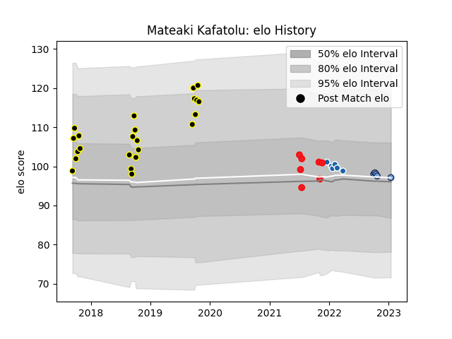

---  
layout: page  
title: Mateaki Kafatolu  
date: 2023-02-02 18:54:57.332699  
categories: player  
---
# Mateaki Kafatolu

## Positions: FL

## Country: Tonga

## Current elo: 96.0

## Current Percentile: 48.0

# Elo History

# Match History

| Team              |   Appearances |   Win Rate |
|:------------------|--------------:|-----------:|
| Wellington        |            23 |   0.652174 |
| Bayonne           |             7 |   0.428571 |
| Tonga             |             7 |   0        |
| Castres Olympique |             6 |   0.333333 |

| Opponent          |   Matches |   Win Rate |
|:------------------|----------:|-----------:|
| Auckland          |         3 |   0.333333 |
| Northland         |         3 |   1        |
| Tasman            |         3 |   0        |
| Samoa             |         3 |   0        |
| Waikato           |         3 |   0.666667 |
| Canterbury        |         3 |   0.666667 |
| Brive             |         3 |   0.333333 |
| Munster           |         2 |   0        |
| North Harbour     |         2 |   0.5      |
| Otago             |         2 |   1        |
| Perpignan         |         1 |   1        |
| Toulon            |         1 |   1        |
| Benetton Treviso  |         1 |   0        |
| Taranaki          |         1 |   1        |
| Scotland          |         1 |   0        |
| Scarlets          |         1 |   0        |
| Romania           |         1 |   0        |
| Castres Olympique |         1 |   0        |
| Counties Manukau  |         1 |   1        |
| Bay of Plenty     |         1 |   1        |
| Manawatu          |         1 |   1        |
| Lyon              |         1 |   1        |
| La Rochelle       |         1 |   1        |
| Harlequins        |         1 |   0        |
| England           |         1 |   0        |
| New Zealand       |         1 |   0        |