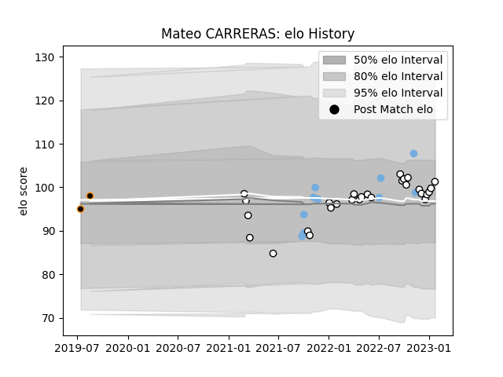

---  
layout: page  
title: Mateo CARRERAS  
date: 2023-03-29 11:31:52.139937  
categories: player  
---
# Mateo CARRERAS

Last updated: 2023-03-29
## Positions: W

## Country: Argentina

## Current elo: 91.0

## Current Percentile: 39.0

# Elo History

# Match History

| Team              |   Appearances |   Win Rate |
|:------------------|--------------:|-----------:|
| Newcastle Falcons |            31 |   0.258065 |
| Argentina         |            10 |   0.4      |
| Jaguares XV       |             4 |   1        |

| Opponent           |   Matches |   Win Rate |
|:-------------------|----------:|-----------:|
| Leicester Tigers   |         4 |   0.25     |
| Australia          |         3 |   0        |
| London Irish       |         3 |   0        |
| Bristol Rugby      |         3 |   0.666667 |
| Northampton Saints |         3 |   0        |
| Worcester Warriors |         2 |   0.5      |
| Wasps              |         2 |   0        |
| Exeter Chiefs      |         2 |   0.5      |
| Sale Sharks        |         2 |   0        |
| Gloucester Rugby   |         2 |   0        |
| Harlequins         |         2 |   0.5      |
| Bath Rugby         |         2 |   0        |
| Wales              |         1 |   0        |
| Valke              |         1 |   1        |
| Saracens           |         1 |   0        |
| Portugal           |         1 |   1        |
| Ireland            |         1 |   0        |
| Leopards           |         1 |   1        |
| Italy              |         1 |   1        |
| Griffons           |         1 |   1        |
| Georgia            |         1 |   1        |
| France             |         1 |   0        |
| England            |         1 |   1        |
| Connacht           |         1 |   1        |
| Cardiff Blues      |         1 |   0        |
| Boland Cavaliers   |         1 |   1        |
| Zebre              |         1 |   1        |