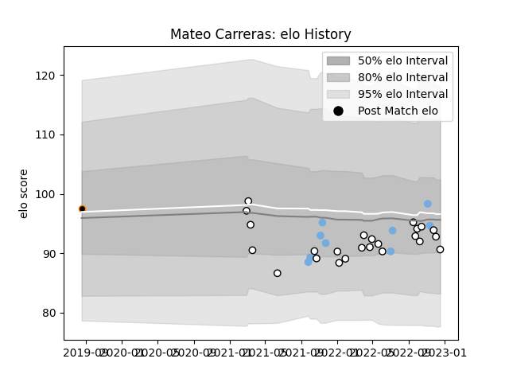

---  
layout: page  
title: Mateo Carreras  
date: 2022-11-16 11:34:03.063858  
categories: player  
---
# Mateo Carreras

## Positions: W

## Country: Argentina

## Current elo: 95.0

## Current Percentile: 61.0

# Elo History

# Match History

| Team              |   Appearances |   Win Rate |
|:------------------|--------------:|-----------:|
| Newcastle Falcons |            21 |   0.190476 |
| Argentina         |             9 |   0.444444 |
| Jaguares XV       |             1 |   1        |

| Opponent           |   Matches |   Win Rate |
|:-------------------|----------:|-----------:|
| Leicester Tigers   |         3 |        0   |
| Northampton Saints |         3 |        0   |
| Gloucester Rugby   |         2 |        0   |
| Wasps              |         2 |        0   |
| Sale Sharks        |         2 |        0   |
| Harlequins         |         2 |        0.5 |
| Australia          |         2 |        0   |
| Bristol Rugby      |         2 |        1   |
| Worcester Warriors |         2 |        0.5 |
| Georgia            |         1 |        1   |
| Ireland            |         1 |        0   |
| Italy              |         1 |        1   |
| Bath Rugby         |         1 |        0   |
| Leopards           |         1 |        1   |
| London Irish       |         1 |        0   |
| France             |         1 |        0   |
| Portugal           |         1 |        1   |
| England            |         1 |        1   |
| Saracens           |         1 |        0   |
| Wales              |         1 |        0   |