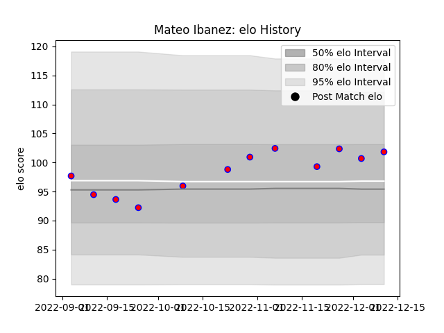

---  
layout: page  
title: Mateo Ibanez  
date: 2022-11-22 11:37:13.282541  
categories: player  
---
# Mateo Ibanez

## Positions: FL

## Current elo: 99.0

## Current Percentile: 69.0

# Elo History

# Match History

| Team    |   Appearances |   Win Rate |
|:--------|--------------:|-----------:|
| Blagnac |             9 |   0.611111 |

| Opponent                   |   Matches |   Win Rate |
|:---------------------------|----------:|-----------:|
| Albi                       |         1 |        1   |
| Carqueiranne-Hyères        |         1 |        1   |
| Chambery                   |         1 |        1   |
| Dax                        |         1 |        0   |
| Narbonne                   |         1 |        0.5 |
| Rennes                     |         1 |        1   |
| Tarbes                     |         1 |        1   |
| US Bressane                |         1 |        0   |
| Valence Romans Drome Rugby |         1 |        0   |