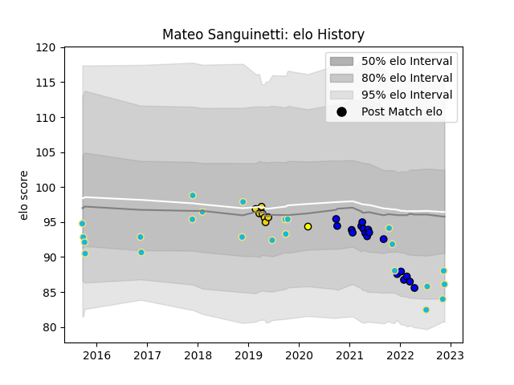

---  
layout: page  
title: Mateo Sanguinetti  
date: 2022-11-16 11:27:56.664945  
categories: player  
---
# Mateo Sanguinetti

## Positions: P

## Country: Uruguay

## Current elo: 88.0

## Current Percentile: 10.0

# Elo History

# Match History

| Team              |   Appearances |   Win Rate |
|:------------------|--------------:|-----------:|
| Uruguay           |            22 |   0.363636 |
| Massy             |            18 |   0.638889 |
| Houston SaberCats |             7 |   0.285714 |
| Penarol Rugby     |             1 |   0        |

| Opponent                   |   Matches |   Win Rate |
|:---------------------------|----------:|-----------:|
| Romania                    |         5 |   0.6      |
| Blagnac                    |         3 |   0.666667 |
| Fiji                       |         3 |   0.333333 |
| Wales                      |         2 |   0        |
| Tarbes                     |         2 |   1        |
| Namibia                    |         2 |   1        |
| Georgia                    |         2 |   0        |
| Spain                      |         2 |   0        |
| Suresnes                   |         2 |   1        |
| Chambery                   |         2 |   0.75     |
| Bourgoin-Jallieu           |         2 |   0.5      |
| Nice                       |         2 |   0        |
| R.U. New York              |         1 |   0        |
| Toronto Arrows             |         1 |   0        |
| Selknam                    |         1 |   0        |
| Seattle Seawolves          |         1 |   0        |
| San Diego Legion           |         1 |   0        |
| United States of America   |         1 |   1        |
| Utah Warriors              |         1 |   1        |
| Albi                       |         1 |   1        |
| Narbonne                   |         1 |   0        |
| Aubenas                    |         1 |   1        |
| Glendale Raptors           |         1 |   0        |
| Germany                    |         1 |   0        |
| England                    |         1 |   0        |
| Dijon                      |         1 |   0        |
| Cognac Saint Jean d'Angély |         1 |   1        |
| Canada                     |         1 |   1        |
| Australia                  |         1 |   0        |
| Austin Elite Rugby         |         1 |   1        |
| Italy                      |         1 |   0        |