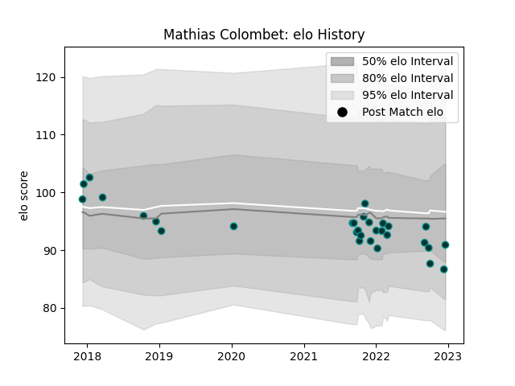

---  
layout: page  
title: Mathias Colombet  
date: 2023-01-13 11:25:14.903244  
categories: player  
---
# Mathias Colombet

## Positions: FB, W

## Current elo: 72.0

## Current Percentile: 9.0

# Elo History

# Match History

| Team   |   Appearances |   Win Rate |
|:-------|--------------:|-----------:|
| Pau    |            32 |    0.46875 |

| Opponent             |   Matches |   Win Rate |
|:---------------------|----------:|-----------:|
| Clermont Auvergne    |         3 |   0.333333 |
| Montpellier Herault  |         3 |   0.333333 |
| Lyon                 |         3 |   0.333333 |
| Agen                 |         2 |   1        |
| Toulon               |         2 |   0.25     |
| Stade Francais Paris |         2 |   0.5      |
| Perpignan            |         2 |   1        |
| La Rochelle          |         2 |   0        |
| Bordeaux Begles      |         2 |   0.5      |
| Cheetahs             |         1 |   0        |
| Dragons              |         1 |   1        |
| Bayonne              |         1 |   0.5      |
| Castres Olympique    |         1 |   0        |
| Calvisano            |         1 |   1        |
| Ospreys              |         1 |   0        |
| Brive                |         1 |   1        |
| Stade Toulousain     |         1 |   0        |
| Biarritz Olympique   |         1 |   1        |
| Worcester Warriors   |         1 |   0        |
| Zebre                |         1 |   1        |