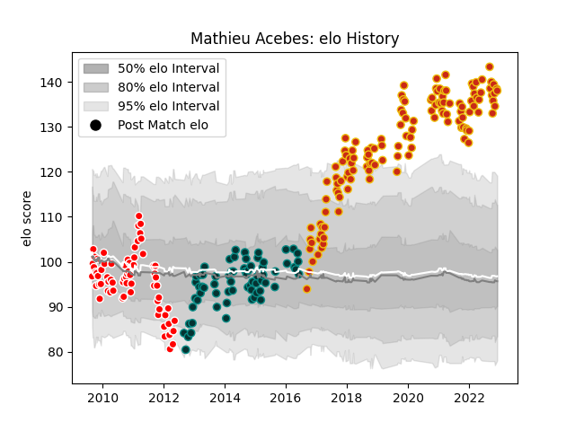

---  
layout: page  
title: Mathieu Acebes  
date: 2022-12-18 16:13:04.415287  
categories: player  
---
# Mathieu Acebes

## Positions: W, C

## Current elo: 140.0

## Current Percentile: 99.0

# Elo History

# Match History

| Team      |   Appearances |   Win Rate |
|:----------|--------------:|-----------:|
| Perpignan |           129 |   0.577519 |
| Auch      |            69 |   0.442029 |
| Pau       |            69 |   0.623188 |

| Opponent                   |   Matches |   Win Rate |
|:---------------------------|----------:|-----------:|
| Aurillac                   |        14 |   0.678571 |
| Dax                        |        14 |   0.464286 |
| Grenoble                   |        12 |   0.5      |
| Colomiers                  |        12 |   0.5      |
| Oyonnax                    |        11 |   0.545455 |
| Beziers                    |        11 |   0.636364 |
| Narbonne                   |        11 |   0.636364 |
| Carcassonne                |        11 |   0.590909 |
| Lyon                       |        10 |   0.4      |
| Pau                        |        10 |   0.15     |
| La Rochelle                |         9 |   0.111111 |
| Biarritz Olympique         |         9 |   1        |
| Mont-de-Marsan             |         9 |   0.666667 |
| Provence Rugby             |         7 |   0.714286 |
| Montauban                  |         7 |   0.857143 |
| Soyaux-Angouleme           |         7 |   0.928571 |
| Tarbes                     |         7 |   0.357143 |
| Agen                       |         7 |   0.428571 |
| Bordeaux Begles            |         7 |   0.5      |
| Bourgoin-Jallieu           |         7 |   0.857143 |
| Toulon                     |         6 |   0.333333 |
| Brive                      |         5 |   0.4      |
| Castres Olympique          |         5 |   0.2      |
| Stade Francais Paris       |         5 |   0        |
| Montpellier Herault        |         5 |   0.4      |
| Albi                       |         5 |   0.7      |
| Massy                      |         5 |   0.8      |
| Nevers                     |         4 |   0.75     |
| Racing 92                  |         4 |   0.25     |
| Stade Toulousain           |         4 |   0.25     |
| Vannes                     |         4 |   1        |
| Bayonne                    |         3 |   0.666667 |
| Clermont Auvergne          |         3 |   0.333333 |
| Auch                       |         3 |   0.666667 |
| Valence Romans Drome Rugby |         2 |   1        |
| Lannemezan                 |         2 |   1        |
| Saint-Etienne              |         2 |   1        |
| Perpignan                  |         2 |   0.5      |
| Périgueux                  |         2 |   1        |
| Sale Sharks                |         1 |   0        |
| Roval Drome XV             |         1 |   1        |
| Glasgow Warriors           |         1 |   0        |
| US Bressane                |         1 |   1        |