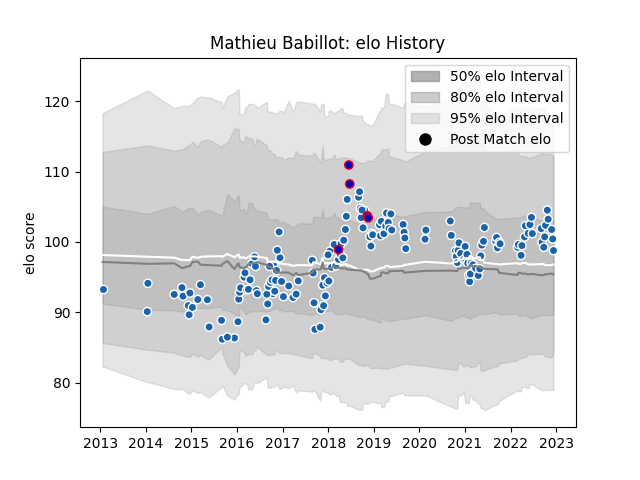

---  
layout: page  
title: Mathieu Babillot  
date: 2023-01-23 15:29:39.966347  
categories: player  
---
# Mathieu Babillot

## Positions: FL

## Country: France

## Current elo: 105.0

## Current Percentile: 74.0

# Elo History

# Match History

| Team              |   Appearances |   Win Rate |
|:------------------|--------------:|-----------:|
| Castres Olympique |           160 |   0.521875 |
| France            |             5 |   0.2      |

| Opponent             |   Matches |   Win Rate |
|:---------------------|----------:|-----------:|
| Racing 92            |        15 |   0.4      |
| Montpellier Herault  |        14 |   0.428571 |
| Stade Toulousain     |        13 |   0.653846 |
| Pau                  |        13 |   0.769231 |
| Bordeaux Begles      |        12 |   0.541667 |
| Stade Francais Paris |        12 |   0.333333 |
| Toulon               |        11 |   0.454545 |
| La Rochelle          |        10 |   0.5      |
| Agen                 |         7 |   0.714286 |
| Clermont Auvergne    |         7 |   0.571429 |
| Brive                |         6 |   0.5      |
| Oyonnax              |         5 |   0.8      |
| Bayonne              |         5 |   0.5      |
| Lyon                 |         5 |   1        |
| Grenoble             |         4 |   0.75     |
| Exeter Chiefs        |         3 |   0.333333 |
| Leinster             |         3 |   0        |
| Northampton Saints   |         2 |   0.5      |
| Perpignan            |         2 |   0.5      |
| Wasps                |         2 |   0        |
| New Zealand          |         2 |   0        |
| Munster              |         2 |   0.5      |
| Dragons              |         1 |   0        |
| Argentina            |         1 |   1        |
| Sale Sharks          |         1 |   0        |
| South Africa         |         1 |   0        |
| Leicester Tigers     |         1 |   1        |
| Biarritz Olympique   |         1 |   1        |
| Harlequins           |         1 |   0        |
| Ulster               |         1 |   0        |
| Wales                |         1 |   0        |
| Gloucester Rugby     |         1 |   0        |