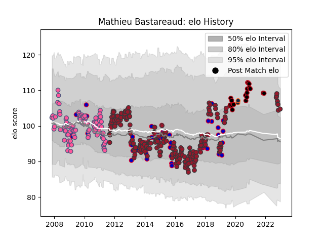

---  
layout: page  
title: Mathieu Bastareaud  
date: 2023-01-13 11:32:03.616495  
categories: player  
---
# Mathieu Bastareaud

## Positions: C

## Country: France

## Current elo: 108.0

## Current Percentile: 80.0

# Elo History

# Match History

| Team                 |   Appearances |   Win Rate |
|:---------------------|--------------:|-----------:|
| Toulon               |           218 |   0.658257 |
| Stade Francais Paris |            99 |   0.555556 |
| France               |            55 |   0.509091 |
| Lyon                 |            19 |   0.710526 |
| R.U. New York        |             2 |   0.5      |

| Opponent             |   Matches |   Win Rate |
|:---------------------|----------:|-----------:|
| Clermont Auvergne    |        26 |   0.461538 |
| Stade Toulousain     |        25 |   0.38     |
| Montpellier Herault  |        22 |   0.590909 |
| Castres Olympique    |        20 |   0.775    |
| Racing 92            |        17 |   0.411765 |
| Stade Francais Paris |        16 |   0.65625  |
| Bordeaux Begles      |        16 |   0.75     |
| Bayonne              |        15 |   0.7      |
| Brive                |        15 |   0.533333 |
| La Rochelle          |        11 |   0.590909 |
| Grenoble             |        11 |   0.590909 |
| Perpignan            |        10 |   0.3      |
| Biarritz Olympique   |        10 |   0.5      |
| Pau                  |         9 |   0.833333 |
| Lyon                 |         9 |   0.833333 |
| Agen                 |         9 |   0.888889 |
| Italy                |         8 |   0.875    |
| Toulon               |         8 |   0.4375   |
| England              |         8 |   0.5      |
| Bourgoin-Jallieu     |         7 |   1        |
| Scarlets             |         7 |   0.714286 |
| New Zealand          |         7 |   0.142857 |
| Ulster               |         6 |   0.833333 |
| Scotland             |         6 |   1        |
| Ireland              |         6 |   0.25     |
| Oyonnax              |         6 |   0.833333 |
| Wales                |         6 |   0.333333 |
| Bath Rugby           |         5 |   0.8      |
| Harlequins           |         4 |   0.25     |
| Saracens             |         4 |   0.5      |
| Sale Sharks          |         4 |   1        |
| Leinster             |         4 |   1        |
| Mont-de-Marsan       |         4 |   1        |
| Montauban            |         4 |   0.375    |
| Dax                  |         4 |   1        |
| South Africa         |         3 |   0        |
| Australia            |         3 |   0.333333 |
| Wasps                |         3 |   0.666667 |
| Cardiff Blues        |         3 |   1        |
| Newcastle Falcons    |         3 |   0.666667 |
| Edinburgh            |         3 |   0        |
| Leicester Tigers     |         3 |   0.666667 |
| Benetton Treviso     |         2 |   1        |
| Exeter Chiefs        |         2 |   1        |
| Fiji                 |         2 |   0.5      |
| Argentina            |         2 |   0.5      |
| Yorkshire Carnegie   |         2 |   1        |
| Albi                 |         2 |   1        |
| Munster              |         2 |   0.5      |
| Japan                |         1 |   0.5      |
| Canada               |         1 |   1        |
| Auch                 |         1 |   0        |
| San Diego Legion     |         1 |   0        |
| Tonga                |         1 |   1        |
| Glasgow Warriors     |         1 |   1        |
| Romania              |         1 |   1        |
| Bucuresti            |         1 |   1        |
| Houston SaberCats    |         1 |   1        |