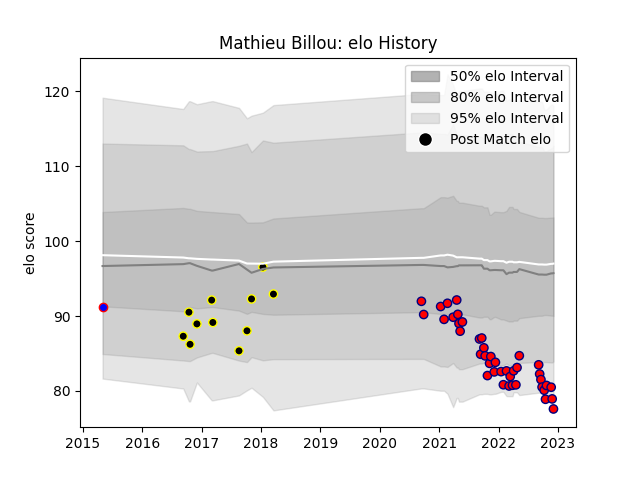

---  
layout: page  
title: Mathieu Billou  
date: 2023-01-17 11:29:53.518130  
categories: player  
---
# Mathieu Billou

## Positions: SH

## Current elo: 84.0

## Current Percentile: 30.0

# Elo History

# Match History

| Team                       |   Appearances |   Win Rate |
|:---------------------------|--------------:|-----------:|
| Cognac Saint Jean d'Angély |            43 |   0.27907  |
| Mont-de-Marsan             |            31 |   0.548387 |
| Beziers                    |             3 |   0.666667 |

| Opponent                   |   Matches |   Win Rate |
|:---------------------------|----------:|-----------:|
| Albi                       |         6 |   0.333333 |
| Bourgoin-Jallieu           |         5 |   0.6      |
| Massy                      |         4 |   0.25     |
| Dax                        |         4 |   0.75     |
| Blagnac                    |         4 |   0.25     |
| Tarbes                     |         4 |   0        |
| Nice                       |         3 |   0.333333 |
| Soyaux-Angouleme           |         3 |   0.333333 |
| Suresnes                   |         3 |   0.333333 |
| Narbonne                   |         3 |   0.333333 |
| Carcassonne                |         3 |   1        |
| Valence Romans Drome Rugby |         3 |   0        |
| Beziers                    |         3 |   0.666667 |
| Aurillac                   |         3 |   0.333333 |
| Aubenas                    |         3 |   0.333333 |
| Perpignan                  |         2 |   1        |
| Oyonnax                    |         2 |   0.5      |
| US Bressane                |         2 |   0        |
| Agen                       |         2 |   0.5      |
| Dijon                      |         2 |   1        |
| Colomiers                  |         2 |   0        |
| Chambery                   |         2 |   0.5      |
| Biarritz Olympique         |         2 |   0        |
| Vannes                     |         2 |   1        |
| Nevers                     |         1 |   0        |
| Montauban                  |         1 |   0        |
| Mont-de-Marsan             |         1 |   1        |
| Rennes                     |         1 |   0        |
| Grenoble                   |         1 |   0        |