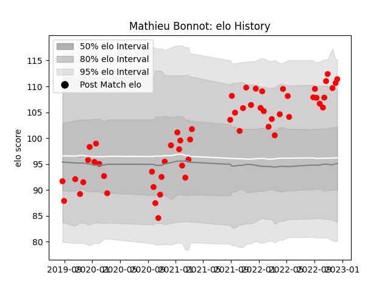

---  
layout: page  
title: Mathieu Bonnot  
date: 2022-12-14 11:16:06.633297  
categories: player  
---
# Mathieu Bonnot

## Positions: H

## Current elo: 111.0

## Current Percentile: 90.0

# Elo History

# Match History

| Team   |   Appearances |   Win Rate |
|:-------|--------------:|-----------:|
| Rouen  |            57 |   0.412281 |

| Opponent                   |   Matches |   Win Rate |
|:---------------------------|----------:|-----------:|
| Carcassonne                |         6 |   0.166667 |
| Colomiers                  |         6 |   0.166667 |
| Vannes                     |         5 |   0.8      |
| Aurillac                   |         5 |   0.4      |
| Provence Rugby             |         4 |   0.375    |
| Montauban                  |         4 |   0.5      |
| Mont-de-Marsan             |         3 |   0.333333 |
| Nevers                     |         3 |   0.333333 |
| Oyonnax                    |         3 |   0.666667 |
| Biarritz Olympique         |         2 |   0.5      |
| Grenoble                   |         2 |   0.5      |
| Beziers                    |         2 |   0.5      |
| Bayonne                    |         2 |   0        |
| Soyaux-Angouleme           |         2 |   0.5      |
| Valence Romans Drome Rugby |         2 |   0.5      |
| Massy                      |         1 |   1        |
| Narbonne                   |         1 |   1        |
| Perpignan                  |         1 |   0        |
| Roval Drome XV             |         1 |   1        |
| US Bressane                |         1 |   0        |
| Agen                       |         1 |   0        |