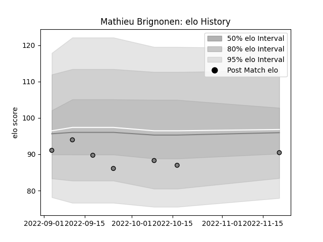

---  
layout: page  
title: Mathieu Brignonen  
date: 2023-02-02 18:58:56.373821  
categories: player  
---
# Mathieu Brignonen

## Positions: FB, W

## Current elo: 89.0

## Current Percentile: 50.0

# Elo History

# Match History

| Team   |   Appearances |   Win Rate |
|:-------|--------------:|-----------:|
| Rennes |            12 |  0.0833333 |

| Opponent                   |   Matches |   Win Rate |
|:---------------------------|----------:|-----------:|
| Suresnes                   |         2 |          0 |
| Tarbes                     |         2 |          0 |
| Valence Romans Drome Rugby |         2 |          0 |
| Albi                       |         1 |          0 |
| Carqueiranne-Hyères        |         1 |          1 |
| Chambery                   |         1 |          0 |
| Narbonne                   |         1 |          0 |
| Nice                       |         1 |          0 |
| US Bressane                |         1 |          0 |