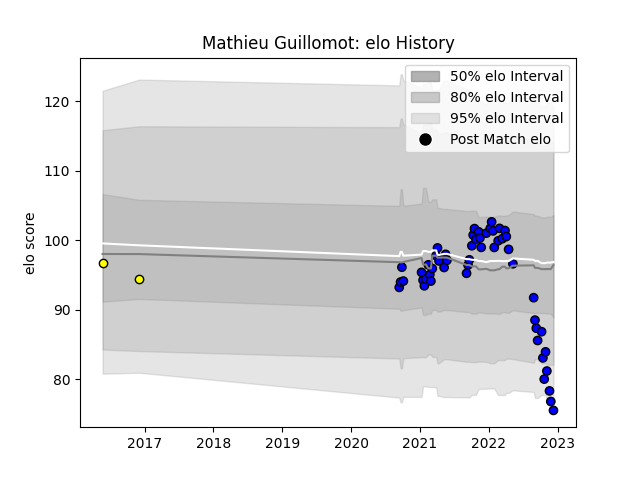

---  
layout: page  
title: Mathieu Guillomot  
date: 2023-02-02 18:49:28.766435  
categories: player  
---
# Mathieu Guillomot

## Positions: C, FH

## Current elo: 67.0

## Current Percentile: 2.0

# Elo History

# Match History

| Team        |   Appearances |   Win Rate |
|:------------|--------------:|-----------:|
| Massy       |            55 |   0.554545 |
| Carcassonne |             9 |   0.444444 |

| Opponent                   |   Matches |   Win Rate |
|:---------------------------|----------:|-----------:|
| Nice                       |         4 |   0.25     |
| Soyaux-Angouleme           |         4 |   0.25     |
| Blagnac                    |         4 |   0.5      |
| Bourgoin-Jallieu           |         4 |   0.75     |
| Tarbes                     |         4 |   0.75     |
| Albi                       |         4 |   0.5      |
| Cognac Saint Jean d'Angély |         3 |   1        |
| Dijon                      |         3 |   0.666667 |
| Aubenas                    |         3 |   1        |
| Chambery                   |         3 |   0.5      |
| Narbonne                   |         2 |   0        |
| Montauban                  |         2 |   0.5      |
| Vannes                     |         2 |   0.5      |
| Dax                        |         2 |   1        |
| Colomiers                  |         2 |   0        |
| US Bressane                |         2 |   0.5      |
| Beziers                    |         2 |   0.5      |
| Valence Romans Drome Rugby |         2 |   1        |
| Oyonnax                    |         2 |   0.5      |
| Suresnes                   |         1 |   1        |
| Rouen                      |         1 |   0        |
| Agen                       |         1 |   0        |
| Perpignan                  |         1 |   1        |
| Nevers                     |         1 |   0        |
| Mont-de-Marsan             |         1 |   1        |
| Carcassonne                |         1 |   1        |
| Biarritz Olympique         |         1 |   0        |
| Aurillac                   |         1 |   0        |
| Grenoble                   |         1 |   0        |