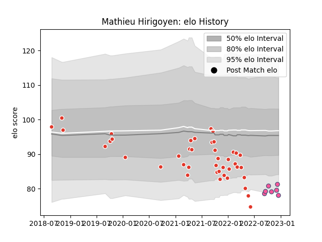

---  
layout: page  
title: Mathieu Hirigoyen  
date: 2023-02-02 18:54:56.374226  
categories: player  
---
# Mathieu Hirigoyen

## Positions: FL

## Current elo: 73.0

## Current Percentile: 7.0

# Elo History

# Match History

| Team                 |   Appearances |   Win Rate |
|:---------------------|--------------:|-----------:|
| Biarritz Olympique   |            65 |   0.446154 |
| Stade Francais Paris |            12 |   0.666667 |

| Opponent                   |   Matches |   Win Rate |
|:---------------------------|----------:|-----------:|
| Perpignan                  |         7 |   0.285714 |
| Colomiers                  |         4 |   0.5      |
| Montauban                  |         4 |   0.5      |
| Mont-de-Marsan             |         4 |   0.5      |
| Castres Olympique          |         4 |   0.25     |
| Provence Rugby             |         3 |   1        |
| Racing 92                  |         3 |   0.666667 |
| La Rochelle                |         3 |   0.666667 |
| Montpellier Herault        |         3 |   0        |
| Pau                        |         3 |   0.333333 |
| Carcassonne                |         3 |   0.333333 |
| Beziers                    |         3 |   0.666667 |
| Rouen                      |         2 |   1        |
| Stade Francais Paris       |         2 |   0.5      |
| Stade Toulousain           |         2 |   0        |
| Toulon                     |         2 |   0        |
| Soyaux-Angouleme           |         2 |   0.5      |
| Aurillac                   |         2 |   0.5      |
| Nevers                     |         2 |   0.5      |
| Lyon                       |         2 |   0        |
| Lions                      |         2 |   0.5      |
| Grenoble                   |         2 |   1        |
| Clermont Auvergne          |         2 |   0        |
| Bordeaux Begles            |         2 |   0.5      |
| Vannes                     |         2 |   0.5      |
| Oyonnax                    |         1 |   0        |
| Bayonne                    |         1 |   1        |
| Roval Drome XV             |         1 |   1        |
| Brive                      |         1 |   1        |
| Benetton Treviso           |         1 |   1        |
| US Bressane                |         1 |   1        |
| Valence Romans Drome Rugby |         1 |   1        |