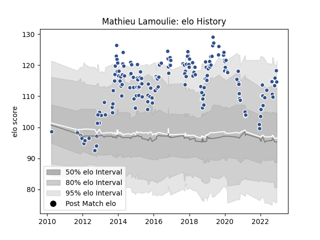

---  
layout: page  
title: Mathieu Lamoulie  
date: 2023-01-13 11:35:09.489185  
categories: player  
---
# Mathieu Lamoulie

## Positions: FB

## Current elo: 117.0

## Current Percentile: 82.0

# Elo History

# Match History

| Team   |   Appearances |   Win Rate |
|:-------|--------------:|-----------:|
| Agen   |           189 |   0.455026 |

| Opponent             |   Matches |   Win Rate |
|:---------------------|----------:|-----------:|
| Castres Olympique    |        10 |   0.2      |
| Clermont Auvergne    |        10 |   0.1      |
| Pau                  |         9 |   0.333333 |
| Bordeaux Begles      |         9 |   0.111111 |
| Lyon                 |         8 |   0.375    |
| Stade Francais Paris |         8 |   0.25     |
| Colomiers            |         8 |   0.5      |
| Toulon               |         7 |   0.285714 |
| Stade Toulousain     |         7 |   0        |
| Grenoble             |         7 |   0.5      |
| Mont-de-Marsan       |         7 |   0.857143 |
| La Rochelle          |         6 |   0.5      |
| Brive                |         6 |   0.666667 |
| Carcassonne          |         5 |   0.8      |
| Narbonne             |         5 |   0.6      |
| Oyonnax              |         5 |   0.4      |
| Bourgoin-Jallieu     |         5 |   0.4      |
| Perpignan            |         5 |   0.6      |
| Montpellier Herault  |         4 |   0        |
| Racing 92            |         4 |   0.5      |
| Montauban            |         4 |   0.75     |
| Albi                 |         4 |   0.75     |
| Dax                  |         4 |   0.5      |
| Biarritz Olympique   |         4 |   0.5      |
| Aurillac             |         4 |   0.75     |
| Massy                |         3 |   1        |
| Tarbes               |         3 |   0.666667 |
| Vannes               |         3 |   1        |
| US Bressane          |         3 |   0.666667 |
| Bayonne              |         3 |   0.5      |
| Calvisano            |         2 |   1        |
| Bucuresti            |         2 |   0.5      |
| Beziers              |         2 |   0.5      |
| Provence Rugby       |         2 |   1        |
| Auch                 |         2 |   0.5      |
| Sale Sharks          |         2 |   0        |
| Wasps                |         1 |   0        |
| Benetton Treviso     |         1 |   1        |
| Bath Rugby           |         1 |   0        |
| Soyaux-Angouleme     |         1 |   1        |
| Nevers               |         1 |   0        |
| Lannemezan           |         1 |   1        |
| Zebre                |         1 |   1        |