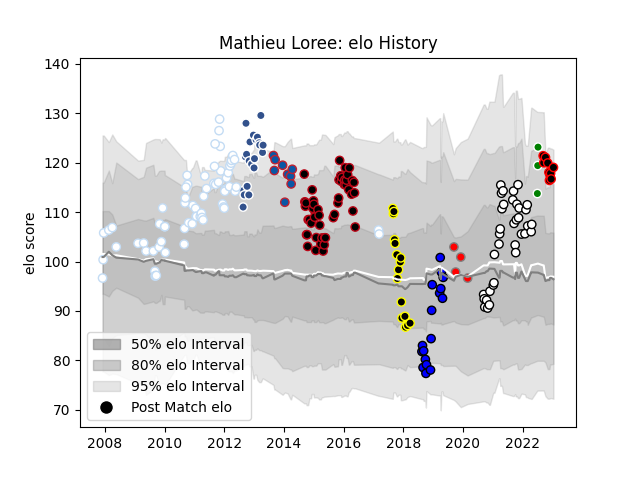

---  
layout: page  
title: Mathieu Loree  
date: 2023-01-15 11:42:23.171348  
categories: player  
---
# Mathieu Loree

## Positions: SH, FH

## Country: Algeria

## Current elo: 119.0

## Current Percentile: 90.0

# Elo History

# Match History

| Team                       |   Appearances |   Win Rate |
|:---------------------------|--------------:|-----------:|
| Racing 92                  |            68 |   0.492647 |
| Lyon                       |            51 |   0.578431 |
| Valence Romans Drome Rugby |            35 |   0.528571 |
| Agen                       |            21 |   0.238095 |
| Massy                      |            17 |   0.205882 |
| Mont-de-Marsan             |            16 |   0.625    |
| Nice                       |            10 |   0.45     |
| Grenoble                   |             9 |   0.166667 |
| Roval Drome XV             |             4 |   0        |
| Algeria                    |             3 |   0.666667 |

| Opponent                   |   Matches |   Win Rate |
|:---------------------------|----------:|-----------:|
| Bayonne                    |        13 |   0.461538 |
| Clermont Auvergne          |        10 |   0.3      |
| Grenoble                   |         9 |   0.333333 |
| Perpignan                  |         9 |   0.277778 |
| Castres Olympique          |         9 |   0.333333 |
| Toulon                     |         8 |   0.25     |
| Montpellier Herault        |         8 |   0.25     |
| Stade Toulousain           |         7 |   0.428571 |
| Stade Francais Paris       |         7 |   0.714286 |
| Aurillac                   |         7 |   0.571429 |
| Carcassonne                |         6 |   1        |
| Montauban                  |         6 |   0.333333 |
| Dax                        |         6 |   0.5      |
| Mont-de-Marsan             |         6 |   0.583333 |
| Bourgoin-Jallieu           |         6 |   0.333333 |
| Bordeaux Begles            |         6 |   0.5      |
| Biarritz Olympique         |         6 |   0.5      |
| Albi                       |         5 |   0.9      |
| Oyonnax                    |         5 |   0.2      |
| Brive                      |         5 |   0.8      |
| Provence Rugby             |         5 |   0.4      |
| Vannes                     |         5 |   0.4      |
| Racing 92                  |         5 |   0        |
| Agen                       |         5 |   0.4      |
| Nevers                     |         4 |   0.5      |
| Narbonne                   |         4 |   0.5      |
| Edinburgh                  |         4 |   0.25     |
| Soyaux-Angouleme           |         4 |   0.125    |
| Colomiers                  |         4 |   0.5      |
| Beziers                    |         4 |   0.5      |
| Tarbes                     |         4 |   0.5      |
| La Rochelle                |         4 |   0.375    |
| Rouen                      |         3 |   0.333333 |
| Blagnac                    |         3 |   0.666667 |
| Chambery                   |         3 |   0.666667 |
| Cognac Saint Jean d'Angély |         2 |   1        |
| Cardiff Blues              |         2 |   0        |
| Massy                      |         2 |   0        |
| Lyon                       |         2 |   1        |
| Aubenas                    |         2 |   1        |
| London Welsh               |         2 |   1        |
| Leinster                   |         2 |   0        |
| Senegal                    |         1 |   1        |
| Suresnes                   |         1 |   1        |
| US Bressane                |         1 |   0        |
| Wasps                      |         1 |   0        |
| London Irish               |         1 |   0        |
| Saracens                   |         1 |   1        |
| Rennes                     |         1 |   1        |
| Pau                        |         1 |   1        |
| Nice                       |         1 |   1        |
| Kenya                      |         1 |   0        |
| Dijon                      |         1 |   1        |
| Carqueiranne-Hyères        |         1 |   1        |
| Auch                       |         1 |   1        |
| Arix Viadana               |         1 |   0.5      |
| Zimbabwe                   |         1 |   1        |