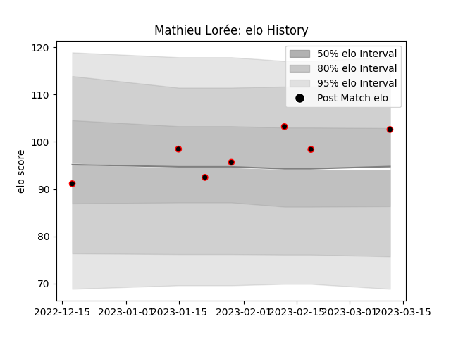

---  
layout: page  
title: Mathieu Lorée  
date: 2023-02-24 02:23:06.905381  
categories: player  
---
# Mathieu Lorée

## Positions: SH

## Current elo: 92.0

## Current Percentile: 55.0

# Elo History

# Match History

| Team   |   Appearances |   Win Rate |
|:-------|--------------:|-----------:|
| Nice   |             9 |   0.611111 |

| Opponent                   |   Matches |   Win Rate |
|:---------------------------|----------:|-----------:|
| Albi                       |         1 |        0.5 |
| Blagnac                    |         1 |        1   |
| Bourgoin-Jallieu           |         1 |        0   |
| Carqueiranne-Hyères        |         1 |        1   |
| Dax                        |         1 |        0   |
| Narbonne                   |         1 |        0   |
| Rennes                     |         1 |        1   |
| Suresnes                   |         1 |        1   |
| Valence Romans Drome Rugby |         1 |        1   |