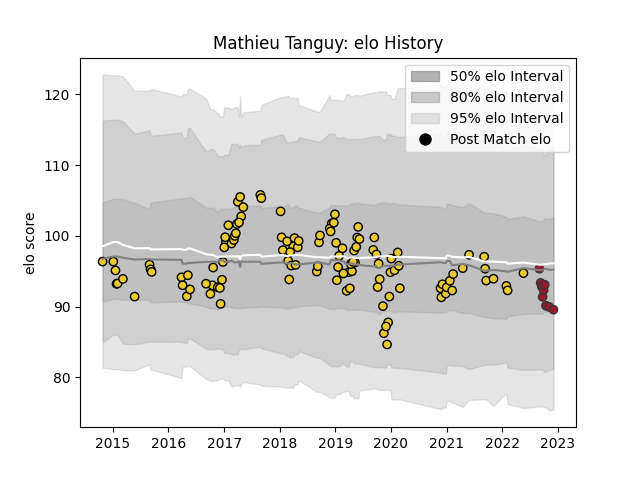

---  
layout: page  
title: Mathieu Tanguy  
date: 2023-01-06 00:21:14.779356  
categories: player  
---
# Mathieu Tanguy

## Positions: L

## Current elo: 90.0

## Current Percentile: 14.0

# Elo History

# Match History

| Team        |   Appearances |   Win Rate |
|:------------|--------------:|-----------:|
| La Rochelle |           119 |   0.55042  |
| Toulon      |            11 |   0.454545 |

| Opponent             |   Matches |   Win Rate |
|:---------------------|----------:|-----------:|
| Racing 92            |        12 |   0.458333 |
| Bayonne              |        10 |   0.6      |
| Stade Francais Paris |        10 |   0.6      |
| Montpellier Herault  |        10 |   0.45     |
| Clermont Auvergne    |         9 |   0.222222 |
| Castres Olympique    |         8 |   0.5      |
| Toulon               |         7 |   0.571429 |
| Stade Toulousain     |         7 |   0.285714 |
| Pau                  |         7 |   0.857143 |
| Lyon                 |         7 |   0.428571 |
| Brive                |         6 |   1        |
| Bordeaux Begles      |         5 |   0.6      |
| Grenoble             |         4 |   0.75     |
| Agen                 |         3 |   0.666667 |
| Perpignan            |         3 |   0.666667 |
| Zebre                |         3 |   1        |
| Gloucester Rugby     |         3 |   0.333333 |
| Glasgow Warriors     |         2 |   0.5      |
| Oyonnax              |         2 |   0.25     |
| Bristol Rugby        |         2 |   1        |
| La Rochelle          |         1 |   0        |
| Exeter Chiefs        |         1 |   0        |
| Edinburgh            |         1 |   1        |
| Connacht             |         1 |   0        |
| Sale Sharks          |         1 |   1        |
| Scarlets             |         1 |   0        |
| Biarritz Olympique   |         1 |   0        |
| Benetton Treviso     |         1 |   1        |
| Ulster               |         1 |   0        |
| Harlequins           |         1 |   1        |