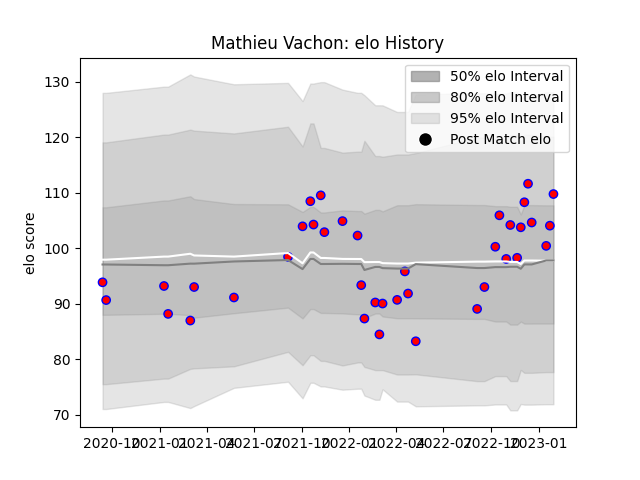

---  
layout: page  
title: Mathieu Vachon  
date: 2023-02-02 18:42:08.457203  
categories: player  
---
# Mathieu Vachon

## Positions: N8, FL

## Current elo: 110.0

## Current Percentile: 66.0

# Elo History

# Match History

| Team    |   Appearances |   Win Rate |
|:--------|--------------:|-----------:|
| Blagnac |            38 |   0.552632 |

| Opponent                   |   Matches |   Win Rate |
|:---------------------------|----------:|-----------:|
| Albi                       |         3 |   0.333333 |
| Dax                        |         3 |   0.333333 |
| US Bressane                |         3 |   0.333333 |
| Tarbes                     |         3 |   0.833333 |
| Suresnes                   |         3 |   0.666667 |
| Aubenas                    |         3 |   0.666667 |
| Valence Romans Drome Rugby |         3 |   0.666667 |
| Bourgoin-Jallieu           |         3 |   0.333333 |
| Dijon                      |         2 |   0.5      |
| Cognac Saint Jean d'Angély |         2 |   0.5      |
| Nice                       |         2 |   0        |
| Chambery                   |         2 |   1        |
| Massy                      |         2 |   1        |
| Narbonne                   |         1 |   0.5      |
| Rennes                     |         1 |   1        |
| Soyaux-Angouleme           |         1 |   0        |
| Carqueiranne-Hyères        |         1 |   1        |