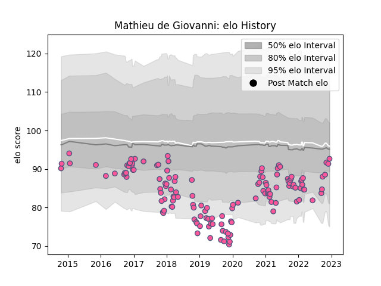

---  
layout: page  
title: Mathieu de Giovanni  
date: 2022-12-14 11:33:55.333029  
categories: player  
---
# Mathieu de Giovanni

## Positions: L, FL

## Current elo: 93.0

## Current Percentile: 33.0

# Elo History

# Match History

| Team                 |   Appearances |   Win Rate |
|:---------------------|--------------:|-----------:|
| Stade Francais Paris |           136 |   0.411765 |

| Opponent            |   Matches |   Win Rate |
|:--------------------|----------:|-----------:|
| Pau                 |        11 |   0.454545 |
| Castres Olympique   |        11 |   0.545455 |
| Stade Toulousain    |        11 |   0.409091 |
| Montpellier Herault |         9 |   0.388889 |
| Brive               |         9 |   0.444444 |
| Racing 92           |         9 |   0.333333 |
| Clermont Auvergne   |         8 |   0.375    |
| Toulon              |         8 |   0.25     |
| Bordeaux Begles     |         7 |   0.285714 |
| Lyon                |         7 |   0.142857 |
| Agen                |         6 |   0.5      |
| La Rochelle         |         5 |   0.2      |
| Edinburgh           |         4 |   0.5      |
| Bayonne             |         3 |   1        |
| Timisoara Saracens  |         2 |   1        |
| Perpignan           |         2 |   1        |
| Worcester Warriors  |         2 |   0        |
| Oyonnax             |         2 |   0.5      |
| Krasny Yar          |         2 |   0.5      |
| London Irish        |         2 |   0.5      |
| Grenoble            |         2 |   0        |
| Dragons             |         2 |   0        |
| Connacht            |         2 |   0.5      |
| Bucuresti           |         2 |   1        |
| Bristol Rugby       |         2 |   0        |
| Biarritz Olympique  |         2 |   0.5      |
| Ospreys             |         1 |   0        |
| Harlequins          |         1 |   0        |
| Benetton Treviso    |         1 |   1        |
| Zebre               |         1 |   1        |