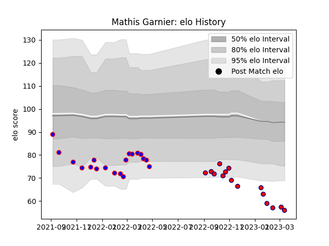

---  
layout: page  
title: Mathis Garnier  
date: 2023-03-21 18:26:02.229487  
categories: player  
---
# Mathis Garnier

Last updated: 2023-03-21
## Positions: FH, SH

## Current elo: 56.0

## Current Percentile: 0.0

# Elo History

# Match History

| Team                       |   Appearances |   Win Rate |
|:---------------------------|--------------:|-----------:|
| Dijon                      |            19 |   0.289474 |
| Cognac Saint Jean d'Angély |            15 |   0        |

| Opponent                   |   Matches |   Win Rate |
|:---------------------------|----------:|-----------:|
| Dax                        |         4 |   0.25     |
| Valence Romans Drome Rugby |         3 |   0.333333 |
| Nice                       |         3 |   0.333333 |
| Chambery                   |         3 |   0        |
| US Bressane                |         2 |   0        |
| Tarbes                     |         2 |   0.25     |
| Suresnes                   |         2 |   0        |
| Rennes                     |         2 |   0        |
| Albi                       |         2 |   0        |
| Carqueiranne-Hyères        |         2 |   0        |
| Bourgoin-Jallieu           |         2 |   0.5      |
| Blagnac                    |         2 |   0        |
| Narbonne                   |         1 |   0        |
| Aubenas                    |         1 |   1        |
| Cognac Saint Jean d'Angély |         1 |   0        |
| Soyaux-Angouleme           |         1 |   0        |
| Massy                      |         1 |   0        |