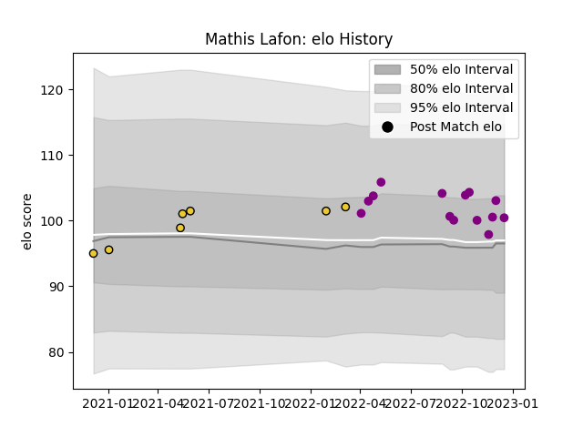

---  
layout: page  
title: Mathis Lafon  
date: 2022-12-18 16:39:50.214061  
categories: player  
---
# Mathis Lafon

## Positions: C

## Current elo: 100.0

## Current Percentile: 73.0

# Elo History

# Match History

| Team             |   Appearances |   Win Rate |
|:-----------------|--------------:|-----------:|
| Soyaux-Angouleme |            14 |   0.5      |
| La Rochelle      |             7 |   0.571429 |

| Opponent            |   Matches |   Win Rate |
|:--------------------|----------:|-----------:|
| Agen                |         2 |        1   |
| Brive               |         2 |        0.5 |
| Lyon                |         1 |        0   |
| Provence Rugby      |         1 |        0   |
| Pau                 |         1 |        1   |
| Oyonnax             |         1 |        0   |
| Montpellier Herault |         1 |        0   |
| Montauban           |         1 |        0   |
| Mont-de-Marsan      |         1 |        0   |
| Massy               |         1 |        1   |
| Grenoble            |         1 |        0   |
| Albi                |         1 |        1   |
| Colomiers           |         1 |        0   |
| Carcassonne         |         1 |        1   |
| Bourgoin-Jallieu    |         1 |        1   |
| Blagnac             |         1 |        1   |
| Aurillac            |         1 |        0   |
| Aubenas             |         1 |        1   |
| Vannes              |         1 |        1   |