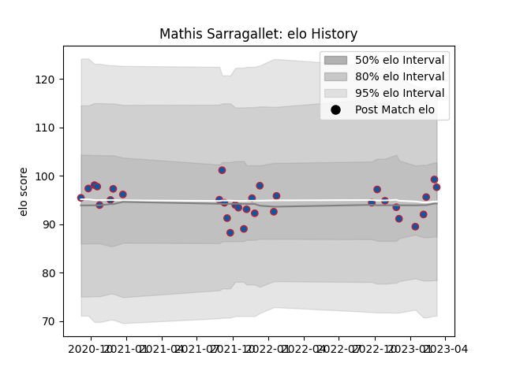

---  
layout: page  
title: Mathis Sarragallet  
date: 2022-12-09 13:18:25.358957  
categories: player  
---
# Mathis Sarragallet

## Positions: H

## Current elo: 94.0

## Current Percentile: 49.0

# Elo History

# Match History

| Team     |   Appearances |   Win Rate |
|:---------|--------------:|-----------:|
| Grenoble |            18 |   0.416667 |

| Opponent           |   Matches |   Win Rate |
|:-------------------|----------:|-----------:|
| Vannes             |         4 |       0.25 |
| Carcassonne        |         2 |       0    |
| Colomiers          |         2 |       0    |
| Agen               |         1 |       1    |
| Aurillac           |         1 |       1    |
| Bayonne            |         1 |       0    |
| Beziers            |         1 |       0    |
| Biarritz Olympique |         1 |       0.5  |
| Mont-de-Marsan     |         1 |       1    |
| Narbonne           |         1 |       1    |
| Nevers             |         1 |       1    |
| Provence Rugby     |         1 |       0    |
| Rouen              |         1 |       1    |