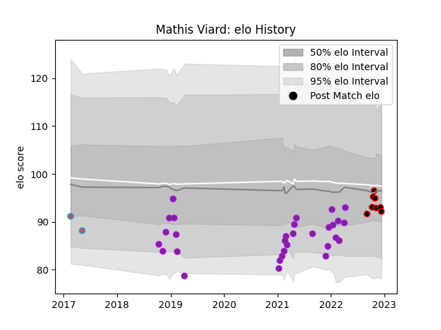

---  
layout: page  
title: Mathis Viard  
date: 2023-02-02 18:53:42.006435  
categories: player  
---
# Mathis Viard

## Positions: FH

## Current elo: 98.0

## Current Percentile: 40.0

# Elo History

# Match History

| Team             |   Appearances |   Win Rate |
|:-----------------|--------------:|-----------:|
| US Bressane      |            53 |   0.509434 |
| Nice             |            12 |   0.375    |
| Bourgoin-Jallieu |             4 |   0        |

| Opponent                   |   Matches |   Win Rate |
|:---------------------------|----------:|-----------:|
| Bayonne                    |         4 |   0        |
| Narbonne                   |         4 |   0.5      |
| Massy                      |         4 |   0.75     |
| Vannes                     |         3 |   0        |
| Aurillac                   |         3 |   0.666667 |
| Beziers                    |         3 |   0.666667 |
| Suresnes                   |         3 |   1        |
| Soyaux-Angouleme           |         3 |   0.333333 |
| Provence Rugby             |         3 |   0.5      |
| Oyonnax                    |         3 |   0.333333 |
| Mont-de-Marsan             |         3 |   0.333333 |
| Albi                       |         2 |   0.25     |
| Tarbes                     |         2 |   1        |
| Rouen                      |         2 |   0.75     |
| Nevers                     |         2 |   0        |
| Montauban                  |         2 |   0        |
| Agen                       |         2 |   0.5      |
| Dax                        |         2 |   0.5      |
| Colomiers                  |         2 |   0        |
| Chambery                   |         2 |   0.5      |
| Carcassonne                |         2 |   0        |
| Biarritz Olympique         |         2 |   0.5      |
| Dijon                      |         1 |   1        |
| Cognac Saint Jean d'Angély |         1 |   1        |
| Carqueiranne-Hyères        |         1 |   1        |
| Perpignan                  |         1 |   0        |
| Rennes                     |         1 |   1        |
| Brive                      |         1 |   1        |
| Bourgoin-Jallieu           |         1 |   0        |
| Blagnac                    |         1 |   1        |
| US Bressane                |         1 |   0        |
| Valence Romans Drome Rugby |         1 |   0        |
| Grenoble                   |         1 |   1        |