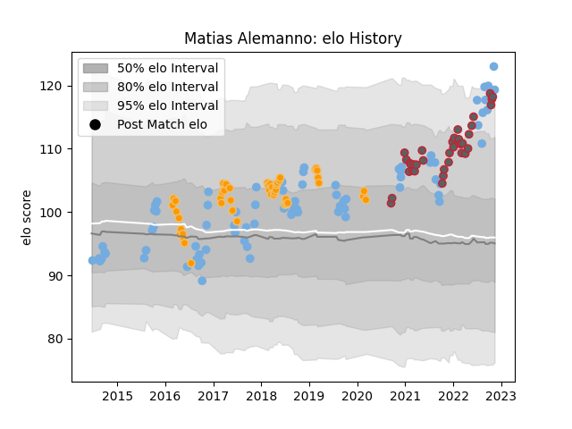

---  
layout: page  
title: Matias Alemanno  
date: 2022-11-16 11:22:08.572339  
categories: player  
---
# Matias Alemanno

## Positions: L

## Country: Argentina

## Current elo: 119.0

## Current Percentile: 97.0

# Elo History

# Match History

| Team             |   Appearances |   Win Rate |
|:-----------------|--------------:|-----------:|
| Argentina        |            79 |   0.291139 |
| Jaguares         |            46 |   0.434783 |
| Gloucester Rugby |            35 |   0.528571 |

| Opponent                 |   Matches |   Win Rate |
|:-------------------------|----------:|-----------:|
| Australia                |        18 |   0.25     |
| South Africa             |        15 |   0.2      |
| New Zealand              |        14 |   0.142857 |
| Lions                    |         8 |   0.375    |
| Sharks                   |         6 |   0.166667 |
| England                  |         6 |   0.166667 |
| Scotland                 |         6 |   0.166667 |
| Wales                    |         6 |   0.25     |
| Stormers                 |         6 |   0.166667 |
| Bristol Rugby            |         5 |   0.4      |
| Southern Kings           |         4 |   0.5      |
| Exeter Chiefs            |         4 |   0.5      |
| London Irish             |         4 |   0.625    |
| Bath Rugby               |         4 |   0.75     |
| Bulls                    |         3 |   0.666667 |
| Harlequins               |         3 |   0        |
| Queensland Reds          |         3 |   0.666667 |
| Ireland                  |         3 |   0.333333 |
| Northampton Saints       |         3 |   0.666667 |
| Wasps                    |         3 |   0.666667 |
| Sale Sharks              |         2 |   0.5      |
| Newcastle Falcons        |         2 |   0.5      |
| Saracens                 |         2 |   1        |
| Leicester Tigers         |         2 |   0        |
| Tonga                    |         2 |   1        |
| Italy                    |         2 |   1        |
| Georgia                  |         2 |   1        |
| France                   |         2 |   0        |
| Crusaders                |         2 |   0        |
| Chiefs                   |         2 |   0.5      |
| Cheetahs                 |         2 |   1        |
| Brumbies                 |         2 |   0.5      |
| Blues                    |         2 |   1        |
| Sunwolves                |         2 |   0.5      |
| United States of America |         1 |   1        |
| Western Force            |         1 |   0        |
| Melbourne Rebels         |         1 |   1        |
| New South Wales Waratahs |         1 |   1        |
| Namibia                  |         1 |   1        |
| Japan                    |         1 |   1        |
| Hurricanes               |         1 |   0        |
| Worcester Warriors       |         1 |   1        |