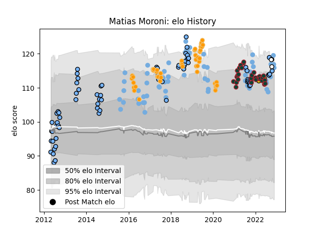

---  
layout: page  
title: Matias Moroni  
date: 2022-12-09 13:23:11.056215  
categories: player  
---
# Matias Moroni

## Positions: C, W

## Country: Argentina

## Current elo: 114.0

## Current Percentile: 91.0

# Elo History

# Match History

| Team              |   Appearances |   Win Rate |
|:------------------|--------------:|-----------:|
| CUBA              |            74 |   0.675676 |
| Argentina         |            68 |   0.301471 |
| Jaguares          |            46 |   0.521739 |
| Leicester Tigers  |            29 |   0.689655 |
| Houston SaberCats |             5 |   0.4      |
| Newcastle Falcons |             4 |   0.5      |

| Opponent                 |   Matches |   Win Rate |
|:-------------------------|----------:|-----------:|
| Australia                |        12 |  0.166667  |
| New Zealand              |        11 |  0.0909091 |
| South Africa             |        10 |  0.1       |
| Belgrano                 |         8 |  0.625     |
| SIC                      |         7 |  0.428571  |
| Pucara                   |         6 |  0.833333  |
| Stormers                 |         6 |  0.333333  |
| Sharks                   |         6 |  0.333333  |
| Scotland                 |         6 |  0.333333  |
| England                  |         6 |  0.166667  |
| Alumni                   |         5 |  0.6       |
| La Plata                 |         5 |  0.7       |
| Lions                    |         5 |  0.4       |
| France                   |         5 |  0.2       |
| Newman                   |         5 |  0.6       |
| San Luis                 |         5 |  0.8       |
| Hindu                    |         5 |  0.4       |
| Bulls                    |         5 |  0.8       |
| Bristol Rugby            |         5 |  0.6       |
| Regatas Bella Vista      |         4 |  0.5       |
| Lomas                    |         4 |  1         |
| Wales                    |         4 |  0.375     |
| Wasps                    |         4 |  0.75      |
| Ireland                  |         4 |  0.25      |
| Los Tilos                |         4 |  0.75      |
| CASI                     |         4 |  0.5       |
| Hurricanes               |         3 |  0.333333  |
| Southern Kings           |         3 |  0.666667  |
| Newcastle Falcons        |         3 |  1         |
| Chiefs                   |         3 |  0.333333  |
| Sale Sharks              |         3 |  0.333333  |
| Saracens                 |         3 |  0.333333  |
| London Irish             |         3 |  0.666667  |
| Harlequins               |         3 |  0.333333  |
| Italy                    |         3 |  1         |
| Brumbies                 |         2 |  0.5       |
| Northampton Saints       |         2 |  1         |
| Blues                    |         2 |  0.5       |
| San Martin               |         2 |  0.5       |
| Sunwolves                |         2 |  1         |
| Tonga                    |         2 |  1         |
| Queensland Reds          |         2 |  1         |
| Pueyrredón               |         2 |  1         |
| Worcester Warriors       |         2 |  1         |
| Atlético del Rosario     |         2 |  1         |
| Exeter Chiefs            |         2 |  1         |
| New South Wales Waratahs |         2 |  1         |
| Seattle Seawolves        |         1 |  1         |
| Western Force            |         1 |  0         |
| Austin Gilgronis         |         1 |  0         |
| Bath Rugby               |         1 |  0         |
| United States of America |         1 |  1         |
| Japan                    |         1 |  1         |
| Liceo Militar            |         1 |  1         |
| Liceo Naval              |         1 |  1         |
| Gloucester Rugby         |         1 |  1         |
| Brive                    |         1 |  1         |
| Georgia                  |         1 |  1         |
| Olivos                   |         1 |  1         |
| Buenos Aires             |         1 |  1         |
| Crusaders                |         1 |  0         |
| Manuel Belgrano          |         1 |  1         |
| Melbourne Rebels         |         1 |  1         |
| San Diego Legion         |         1 |  0         |
| San Cirano               |         1 |  0.5       |
| Namibia                  |         1 |  1         |
| Cheetahs                 |         1 |  1         |
| Romania                  |         1 |  1         |
| Highlanders              |         1 |  0         |
| Dallas Jackals           |         1 |  1         |
| R.U. New York            |         1 |  0         |