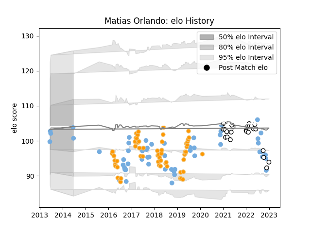

---  
layout: page  
title: Matias Orlando  
date: 2022-11-16 11:33:51.764209  
categories: player  
---
# Matias Orlando

## Positions: C

## Country: Argentina

## Current elo: 78.0

## Current Percentile: 5.0

# Elo History

# Match History

| Team              |   Appearances |   Win Rate |
|:------------------|--------------:|-----------:|
| Jaguares          |            59 |   0.542373 |
| Argentina         |            51 |   0.245098 |
| Newcastle Falcons |            22 |   0.272727 |

| Opponent                 |   Matches |   Win Rate |
|:-------------------------|----------:|-----------:|
| Australia                |        10 |   0.15     |
| Lions                    |         9 |   0.444444 |
| New Zealand              |         9 |   0.222222 |
| Sharks                   |         7 |   0.428571 |
| Scotland                 |         7 |   0.285714 |
| Bulls                    |         6 |   0.666667 |
| England                  |         6 |   0.166667 |
| Stormers                 |         5 |   0.4      |
| South Africa             |         5 |   0.2      |
| Wales                    |         4 |   0        |
| Brumbies                 |         4 |   0.75     |
| Bristol Rugby            |         3 |   0.333333 |
| Northampton Saints       |         3 |   0.333333 |
| Queensland Reds          |         3 |   0.666667 |
| Hurricanes               |         3 |   0.333333 |
| Gloucester Rugby         |         3 |   0.333333 |
| Southern Kings           |         3 |   0.333333 |
| New South Wales Waratahs |         3 |   1        |
| Crusaders                |         3 |   0        |
| Chiefs                   |         3 |   0.666667 |
| Sunwolves                |         3 |   0.666667 |
| France                   |         3 |   0        |
| Sale Sharks              |         2 |   0        |
| Leicester Tigers         |         2 |   0        |
| Exeter Chiefs            |         2 |   0        |
| Blues                    |         2 |   1        |
| Cheetahs                 |         2 |   1        |
| Highlanders              |         2 |   0        |
| London Irish             |         2 |   0.5      |
| Georgia                  |         2 |   1        |
| Melbourne Rebels         |         1 |   1        |
| Wasps                    |         1 |   0        |
| Uruguay                  |         1 |   0        |
| Tonga                    |         1 |   1        |
| Harlequins               |         1 |   1        |
| Ireland                  |         1 |   0        |
| Saracens                 |         1 |   0        |
| Italy                    |         1 |   1        |
| Japan                    |         1 |   1        |
| Bath Rugby               |         1 |   0        |
| Worcester Warriors       |         1 |   1        |